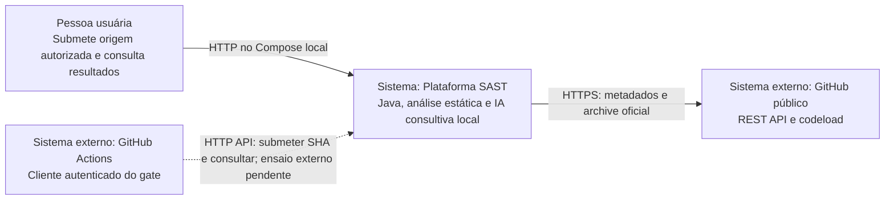
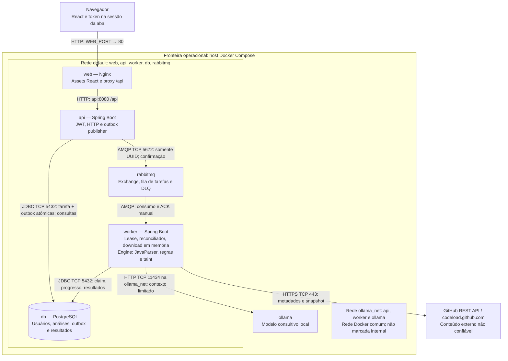

# Arquitetura e fluxos — E-01

Visões C4 de contexto e contêineres, expressas em Mermaid, conferidas contra o [Compose](../compose.yaml). O [manual](Manual-tecnico-e-api.md) detalha contratos e dados; a [matriz BDD](Rastreabilidade-BDD.md) liga os comportamentos às evidências.

## C4 — nível 1: contexto

Ollama pertence ao ambiente local da plataforma. GitHub é uma origem externa não confiável. A implantação Compose publica HTTP, sem terminação TLS configurada; HTTPS de entrada não é uma capacidade comprovada deste ambiente. A aceitação de origens exige HTTPS com host exato `github.com`.

## C4 — nível 2: contêineres

Os seis serviços são os contêineres do Compose; engine e outbox são partes internas, não serviços extras. `api` e `worker` compartilham a imagem, mas apenas o perfil `worker` consome tarefas e reconcilia leases. A API hospeda a publicação. O diagrama mostra os caminhos funcionais: a API também participa de `ollama_net` no Compose, embora a avaliação assíncrona seja executada pelo worker.

## Fronteiras de confiança e persistência

- Navegador → API: JWT Bearer, validação de entrada e filtro por proprietário em consultas e confirmação. O frontend usa somente HTTP.
- Worker → GitHub: conteúdo tratado como dados, nunca compilado ou executado. Redirecionamento restrito a `codeload.github.com`, limites de tamanho e validação dos nomes originais das entradas ZIP.
- Worker → Ollama: resposta não confiável validada antes de se tornar avaliação ou sugestão. A IA não altera findings nem severidades determinísticas.
- Redes Compose não substituem autenticação nem são garantia de isolamento de produção. `WEB_PORT`, `API_PORT` e `DB_PORT` publicam portas no host; RabbitMQ e Ollama não publicam portas neste arquivo. Sem endereço de bind explícito, as portas publicadas não ficam restritas a loopback.
- PostgreSQL usa volume `postgres_data`; Ollama usa `ollama_data`. RabbitMQ não tem volume nomeado declarado no Compose: não se promete retenção da fila após recriar/remover o contêiner. A outbox e a retomada ficam no PostgreSQL.
- Archive, fontes e ASTs ficam em memória durante a tentativa. Persistem metadados, hashes, findings, snippets necessários, traces, avaliações e sugestões. Não há rotina implementada de expurgo por idade.

## Fluxo e estados

1. `POST /api/analyses` autentica, valida e grava análise e outbox na mesma transação; retorna `202`, `Location`, `PROCESSING` e `QUEUED`.
2. O publicador envia o UUID e marca publicação após confirmação. Uma falha mantém o evento disponível para retentativa.
3. O worker assume lease, confirma a mensagem (ACK) antes de processar, fixa SHA e baixa o snapshot oficial. Recuperação após esse ACK depende do estado persistido e da reconciliação de lease. Cada parse usa sua própria instância JavaParser; ASTs podem ser reutilizadas apenas no cache daquela tentativa.
4. `DOWNLOADING` → `DETERMINISTIC`: parser, regras e taint geram resultados e progresso. Mensagem duplicada não deve iniciar outra tentativa já assumida.
5. `SEMANTIC` → `SUGGESTIONS`: enriquecimento consultivo. Falha da IA pode levar a `DEGRADED` sem apagar findings.
6. Consulta periódica HTTP apresenta `COMPLETED` ou `FAILED`, etapas e contadores. Falhas transitórias podem retornar à fila; o reconciliador retoma leases expirados.

`status` usa `PROCESSING`, `COMPLETED`, `FAILED`; `stage` usa `QUEUED`, `DOWNLOADING`, `DETERMINISTIC`, `SEMANTIC`, `SUGGESTIONS`, `COMPLETED`, `FAILED`. Os estados consultivos são `PENDING`, `RUNNING`, `COMPLETED`, `DEGRADED`, `NOT_APPLICABLE`. Cobertura determinística confirmada no histórico não significa sucesso da IA nem ausência de vulnerabilidades.

## Limites da demonstração

[O-01](Operacao-e-escalabilidade.md) observou dois consumidores no mesmo serviço worker, quatro análises concluídas e recuperação de falhas em uma máquina. Isso não comprova múltiplas réplicas, alta disponibilidade ou capacidade de produção. A retomada de lease foi provocada com estado expirado controlado, sem comprovar todos os conflitos possíveis com um worker antigo ainda ativo.
