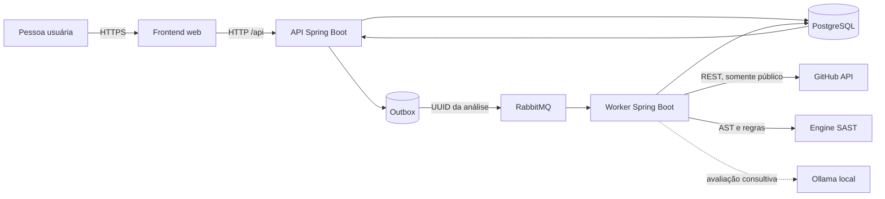

# Arquitetura e fluxos da plataforma SAST

Este documento descreve o comportamento implementado no checkout atual. Itens marcados como pendentes na [matriz de requisitos](Matriz-de-requisitos-CP3.md) não são tratados como funcionalidades entregues.

## Visão de contexto

Fronteiras de confiança:

- A pessoa usuária controla a URL e a referência, mas o backend valida ambas antes de criar a tarefa.
- O GitHub e o conteúdo do repositório são fontes não confiáveis. O worker baixa somente o archive oficial permitido e lê arquivos Java como texto.
- O frontend não acessa PostgreSQL, RabbitMQ, GitHub ou Ollama diretamente.
- O código recebido não é compilado, carregado nem executado. O snapshot e o conteúdo analisado permanecem em memória durante a tentativa.

## Contêineres e responsabilidades

| Contêiner | Responsabilidade | Estado/persistência |
| --- | --- | --- |
| `web` | Entrega o React compilado e encaminha `/api` pelo Nginx. | Sem dados de análise. |
| `api` | Cadastro, login, JWT, validação de origem, criação da análise, consultas e confirmação de tarefas. | PostgreSQL e cache local limitado de resultados concluídos. |
| `worker` | Claim da tarefa, download do snapshot, parser, regras, taint, avaliação e sugestões consultivas. | PostgreSQL; conteúdo do snapshot somente em memória. |
| `db` | Usuários, análises, outbox, progresso, findings, traces e avaliações derivadas. | Volume PostgreSQL. |
| `rabbitmq` | Transporte assíncrono do identificador da análise. | Filas e DLQ do Compose. |
| `ollama` | Modelo local opcional para enriquecimento e sugestões. | Volume do modelo; não é fonte de findings determinísticos. |

## Fluxo de uma análise

1. O frontend envia `POST /api/analyses` com URL HTTPS de `github.com` e referência opcional.
2. A API valida a origem, associa a análise ao usuário autenticado e grava análise e evento de outbox na mesma transação.
3. O publicador confirma a publicação no RabbitMQ; a mensagem contém somente o UUID da análise.
4. O worker assume a tarefa por lease, fixa o commit e baixa o archive oficial. Limites de archive, entradas, arquivos Java, tamanho por arquivo e bytes extraídos são aplicados antes da análise.
5. O parser JavaParser cria ASTs. As regras detectam credencial hardcoded (CWE-798), `Runtime.exec()` (CWE-78), `readObject()` (CWE-502) e o taint intraprocedural para injeção de comando.
6. Findings determinísticos são persistidos. Ollama pode acrescentar avaliação ao finding e sugestões independentes, sem alterar a regra ou a severidade original.
7. O frontend consulta `GET /api/analyses/{id}` periodicamente até `COMPLETED` ou `FAILED`.

## Estados

| Campo | Valores observados | Significado |
| --- | --- | --- |
| `status` | `PROCESSING`, `COMPLETED`, `FAILED` | Estado geral da tentativa. |
| `stage` | `QUEUED`, `DOWNLOADING`, `DETERMINISTIC`, `SEMANTIC`, `SUGGESTIONS`, `COMPLETED`, `FAILED` | Etapa operacional exibida ao frontend. |
| `semanticStatus` | `PENDING`, `RUNNING`, `COMPLETED`, `DEGRADED`, `NOT_APPLICABLE` | Situação da avaliação consultiva dos findings. |
| `suggestionStatus` | `PENDING`, `RUNNING`, `COMPLETED`, `DEGRADED`, `NOT_APPLICABLE` | Situação da geração consultiva de sugestões. |

`DEGRADED` não significa ausência de vulnerabilidades. Quando uma etapa de IA falha ou tem cobertura limitada, os findings determinísticos continuam válidos e a interface informa que a cobertura é parcial.

## Dados derivados e privacidade

O banco guarda metadados da análise, SHA/hash, progresso, findings, localizações, snippets necessários ao resultado, traces, avaliações e sugestões. Não deve guardar o archive ou o código-fonte integral. Tokens, senhas, prompts e respostas brutas não são expostos ao frontend nem registrados.

