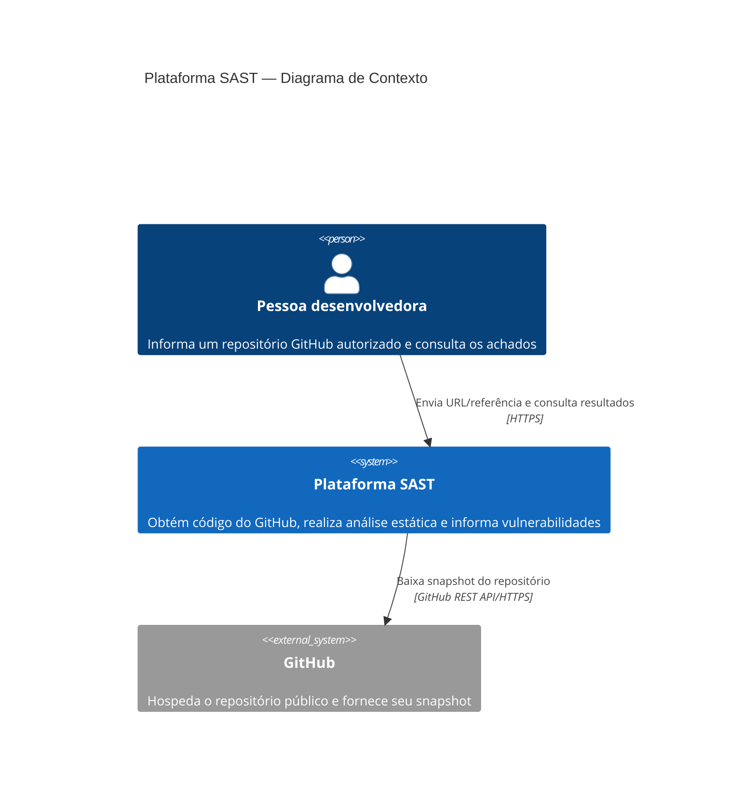
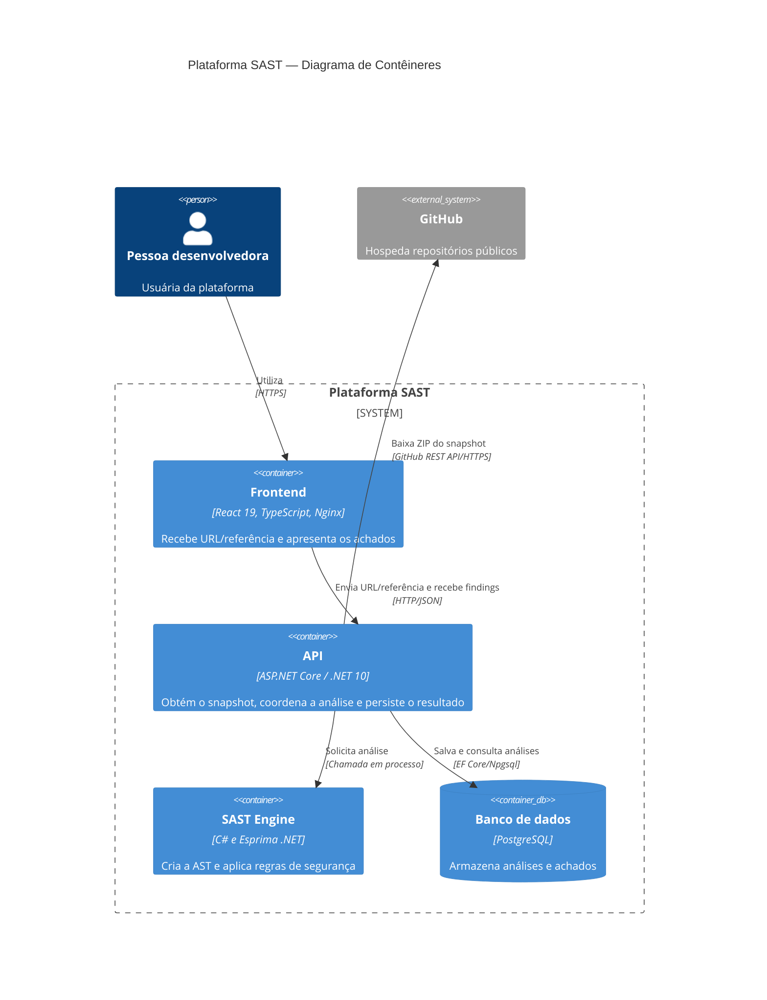
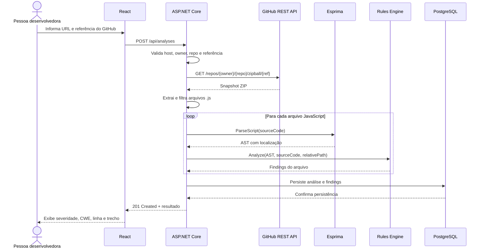

# CP1 — Implementação da Fundação e dos Parsers

> Guia incremental para a primeira entrega da Plataforma SAST.
>
> Documento-base: `CP - Cyber - Documentação de Desenvolvimento.docx`.

## 1. Objetivo da CP1

A CP1 entrega a primeira versão funcional da plataforma de análise estática de segurança. Ao final, uma pessoa desenvolvedora deverá conseguir informar a URL de um repositório público do GitHub, solicitar a análise e receber uma lista de vulnerabilidades encontradas nos arquivos JavaScript pela inspeção de suas ASTs.

O código obtido do GitHub **nunca é executado**. A API baixa um snapshot do repositório, seleciona somente arquivos `.js`, transforma cada arquivo em uma árvore sintática e aplica regras determinísticas. Não são executados `git clone`, instalação de dependências, scripts, builds ou testes do repositório analisado.

### Entregáveis cobertos

| Entregável | Evidência esperada |
|---|---|
| Diagrama de Arquitetura Técnica | Diagramas C4 de contexto e contêineres |
| Ambiente Docker + Docker Compose | `compose.yaml`, Dockerfiles e health checks |
| Repositório estruturado | Monorepo com frontend, backend, engine, testes e documentação |
| Parser funcional | Arquivos JavaScript do repositório convertidos em AST pelo Esprima .NET |
| Construção da AST | Nós com tipo e localização no código-fonte |
| Rules Engine inicial | Contrato comum e execução independente das regras |
| Três violações iniciais | Senha hardcoded, `eval()` e `innerHTML` |
| Demonstração da análise estática | Exemplo reproduzível com três achados |

### Escopo

Incluído na CP1:

- uma única origem: repositórios públicos em `github.com`;
- uma única linguagem analisada: arquivos JavaScript `.js`;
- análise síncrona de um snapshot por requisição;
- tela para URL/referência do GitHub e apresentação do resultado por arquivo;
- persistência dos metadados e achados no PostgreSQL;
- testes automatizados do parser, das regras, do engine e da API.

Ficam para entregas posteriores: autenticação, dashboard, histórico visual, relatórios, Taint Analysis, IA, sugestões de correção, filas, CI/CD e Security Gates.

## 2. Tecnologias

| Camada | Tecnologia | Responsabilidade |
|---|---|---|
| Frontend | React 19, TypeScript e Vite | Receber a URL do GitHub e exibir os achados |
| API | ASP.NET Core / .NET 10 LTS | Baixar o snapshot, validar, orquestrar e expor os resultados |
| Integração | GitHub REST API | Fornecer o archive de um repositório público |
| SAST Engine | C# e Esprima .NET 3.x | Gerar a AST e executar regras de segurança |
| Persistência | EF Core e PostgreSQL | Salvar análises e vulnerabilidades |
| Infraestrutura | Docker, Compose e Nginx | Executar todo o ambiente de forma reproduzível |
| Testes | xUnit e Vitest | Validar backend, engine e frontend |

O Esprima .NET é um parser ECMAScript; ele gera uma AST compatível com o modelo ESTree, informa a localização dos nós e lança `ParserException` para erros sintáticos. Nenhum interpretador JavaScript será instalado no backend.

## 3. Arquitetura C4

### 3.1 Nível 1 — Contexto



### 3.2 Nível 2 — Contêineres



### 3.3 Fluxo interno



## 4. Fase 1 — Criar o monorepo e os esqueletos

### 4.1 Pré-requisitos

- Git;
- .NET SDK 10;
- Node.js em versão LTS e npm;
- Docker Engine com Docker Compose v2.

Validar as instalações:

```bash
git --version
dotnet --version
node --version
npm --version
docker --version
docker compose version
```

### 4.2 Criar o repositório e os diretórios

Executar na pasta que será a raiz do projeto:

```bash
git init
mkdir -p docs docker src/backend tests
dotnet new sln --name Sast --format sln
```

Todo o projeto permanece em um único repositório Git. Não devem ser criados repositórios separados dentro de `src/frontend` ou `src/backend`.

### 4.3 Criar o backend .NET

```bash
dotnet new webapi --framework net10.0 --use-controllers \
  --name Sast.Api --output src/backend/Sast.Api

dotnet new classlib --framework net10.0 \
  --name Sast.Engine --output src/backend/Sast.Engine

dotnet new xunit --framework net10.0 \
  --name Sast.Engine.Tests --output tests/Sast.Engine.Tests

dotnet new xunit --framework net10.0 \
  --name Sast.Api.Tests --output tests/Sast.Api.Tests
```

Adicionar os projetos à solução e configurar as referências:

```bash
dotnet sln Sast.sln add \
  src/backend/Sast.Api/Sast.Api.csproj \
  src/backend/Sast.Engine/Sast.Engine.csproj \
  tests/Sast.Engine.Tests/Sast.Engine.Tests.csproj \
  tests/Sast.Api.Tests/Sast.Api.Tests.csproj

dotnet add src/backend/Sast.Api/Sast.Api.csproj reference \
  src/backend/Sast.Engine/Sast.Engine.csproj

dotnet add tests/Sast.Engine.Tests/Sast.Engine.Tests.csproj reference \
  src/backend/Sast.Engine/Sast.Engine.csproj

dotnet add tests/Sast.Api.Tests/Sast.Api.Tests.csproj reference \
  src/backend/Sast.Api/Sast.Api.csproj
```

Adicionar as dependências:

```bash
dotnet add src/backend/Sast.Engine/Sast.Engine.csproj package Esprima --version 3.0.6
dotnet add src/backend/Sast.Api/Sast.Api.csproj package Microsoft.EntityFrameworkCore.Design --version 10.0.0
dotnet add src/backend/Sast.Api/Sast.Api.csproj package Npgsql.EntityFrameworkCore.PostgreSQL --version 10.0.0
dotnet add tests/Sast.Api.Tests/Sast.Api.Tests.csproj package Microsoft.AspNetCore.Mvc.Testing --version 10.0.0
dotnet add tests/Sast.Api.Tests/Sast.Api.Tests.csproj package Testcontainers.PostgreSql
```

Remover os arquivos de exemplo `WeatherForecast` gerados pelo template e conferir o esqueleto:

```bash
dotnet restore Sast.sln
dotnet build Sast.sln
dotnet run --project src/backend/Sast.Api
```

### 4.4 Criar o frontend React

```bash
npm create vite@latest src/frontend -- --template react-ts
npm --prefix src/frontend install
npm --prefix src/frontend install -D vitest jsdom \
  @testing-library/react @testing-library/jest-dom
npm --prefix src/frontend run dev
```

O frontend possui um único `package.json`. Um workspace npm na raiz não é necessário na CP1 porque existe somente uma aplicação JavaScript.

### 4.5 Configurações compartilhadas

O `.gitignore` da raiz deve conter, no mínimo:

```gitignore
.env
**/bin/
**/obj/
**/node_modules/
**/dist/
.idea/
.vscode/
TestResults/
```

O `.dockerignore` deve impedir o envio de artefatos desnecessários para os builds:

```dockerignore
.git
.env
**/bin
**/obj
**/node_modules
**/dist
TestResults
```

O `README.md` da raiz deverá apresentar o objetivo do monorepo, os pré-requisitos, os comandos rápidos de inicialização e um link para este guia.

O `AGENTS.md` da raiz deverá ser lido por qualquer agente Codex antes de alterar o projeto. Ele registrará o escopo da CP1, as regras de segurança para conteúdo obtido do GitHub, os limites arquiteturais entre frontend/API/engine, os comandos de verificação obrigatórios e as funcionalidades explicitamente adiadas para CP2 e CP3. O arquivo não deve conter tokens, senhas ou instruções para executar código baixado.

### 4.6 Estrutura esperada

```text
/
├── docs/
│   └── CP1-Implementacao-Fundacao-e-Parsers.md
├── docker/
│   └── nginx.conf
├── src/
│   ├── frontend/
│   │   ├── src/
│   │   │   ├── api/
│   │   │   ├── components/
│   │   │   ├── types/
│   │   │   ├── App.tsx
│   │   │   └── main.tsx
│   │   ├── Dockerfile
│   │   └── package.json
│   └── backend/
│       ├── Sast.Api/
│       │   ├── Controllers/
│       │   ├── Contracts/
│       │   ├── Data/
│       │   ├── Integrations/GitHub/
│       │   ├── Models/
│       │   ├── Services/
│       │   ├── Dockerfile
│       │   └── Program.cs
│       └── Sast.Engine/
│           ├── Findings/
│           ├── Parsing/
│           └── Rules/
├── tests/
│   ├── Sast.Api.Tests/
│   └── Sast.Engine.Tests/
├── samples/
│   └── vulnerable.js
├── .dockerignore
├── .env.example
├── .gitignore
├── AGENTS.md
├── compose.yaml
├── README.md
└── Sast.sln
```

Responsabilidades:

- `Sast.Api`: HTTP, integração de leitura com GitHub, validação, persistência e orquestração;
- `Sast.Engine`: parsing, AST, regras e modelos independentes de infraestrutura;
- `frontend`: formulário e visualização dos resultados;
- `tests`: testes separados por unidade arquitetural;
- `samples`: código propositalmente vulnerável usado somente na demonstração;
- `docker`: configuração compartilhada do proxy web;
- `docs`: documentação acadêmica e técnica.

## 5. Fase 2 — Preparar Docker e Docker Compose

### 5.1 Dockerfile da API

Criar `src/backend/Sast.Api/Dockerfile` com build multi-stage. O contexto do build deve ser a raiz do monorepo para que a API consiga copiar o projeto do engine.

```dockerfile
FROM mcr.microsoft.com/dotnet/sdk:10.0 AS build
WORKDIR /src

COPY Sast.sln ./
COPY src/backend/Sast.Api/Sast.Api.csproj src/backend/Sast.Api/
COPY src/backend/Sast.Engine/Sast.Engine.csproj src/backend/Sast.Engine/
RUN dotnet restore src/backend/Sast.Api/Sast.Api.csproj

COPY src/backend/ src/backend/
RUN dotnet publish src/backend/Sast.Api/Sast.Api.csproj \
    --configuration Release \
    --output /app/publish \
    --no-restore

FROM mcr.microsoft.com/dotnet/aspnet:10.0 AS runtime
RUN apt-get update \
    && apt-get install -y --no-install-recommends curl \
    && rm -rf /var/lib/apt/lists/*
WORKDIR /app
COPY --from=build /app/publish .
EXPOSE 8080
ENTRYPOINT ["dotnet", "Sast.Api.dll"]
```

### 5.2 Dockerfile do frontend

Criar `src/frontend/Dockerfile`:

```dockerfile
FROM node:24-alpine AS build
WORKDIR /app
COPY src/frontend/package*.json ./
RUN npm ci
COPY src/frontend/ .
RUN npm run build

FROM nginx:1.29-alpine
COPY --from=build /app/dist /usr/share/nginx/html
COPY docker/nginx.conf /etc/nginx/conf.d/default.conf
EXPOSE 80
```

Como o `nginx.conf` está fora da pasta do frontend, o Compose também usará a raiz do monorepo como contexto desse build.

### 5.3 Proxy Nginx

Criar `docker/nginx.conf`:

```nginx
server {
    listen 80;
    server_name _;

    root /usr/share/nginx/html;
    index index.html;

    location /api/ {
        proxy_pass http://api:8080;
        proxy_set_header Host $host;
        proxy_set_header X-Forwarded-For $proxy_add_x_forwarded_for;
        proxy_set_header X-Forwarded-Proto $scheme;
    }

    location /health {
        proxy_pass http://api:8080/health;
    }

    location / {
        try_files $uri /index.html;
    }
}
```

O proxy permite que o frontend use URLs relativas como `/api/analyses`, evitando uma configuração de CORS na execução via Compose.

### 5.4 Variáveis de ambiente

Criar `.env.example` sem credenciais reais:

```dotenv
POSTGRES_DB=sast
POSTGRES_USER=sast
POSTGRES_PASSWORD=change-me
WEB_PORT=3000
API_PORT=8080
GITHUB_TOKEN=
```

`GITHUB_TOKEN` é opcional na CP1, pois o endpoint de archive aceita acesso anônimo a repositórios públicos. Quando preenchido, deve ser um token fine-grained somente leitura, mantido exclusivamente no backend. Ele nunca deve ser enviado ao frontend, persistido ou incluído em logs.

Copiar para `.env` somente no ambiente local:

```bash
cp .env.example .env
```

Adicionar `.env` ao `.gitignore`.

### 5.5 Compose da raiz

Criar `compose.yaml`:

```yaml
services:
  db:
    image: postgres:18-alpine
    environment:
      POSTGRES_DB: ${POSTGRES_DB}
      POSTGRES_USER: ${POSTGRES_USER}
      POSTGRES_PASSWORD: ${POSTGRES_PASSWORD}
    volumes:
      - postgres_data:/var/lib/postgresql
    healthcheck:
      test: ["CMD-SHELL", "pg_isready -U ${POSTGRES_USER} -d ${POSTGRES_DB}"]
      interval: 5s
      timeout: 5s
      retries: 10

  api:
    build:
      context: .
      dockerfile: src/backend/Sast.Api/Dockerfile
    environment:
      ASPNETCORE_ENVIRONMENT: Development
      ASPNETCORE_URLS: http://+:8080
      ConnectionStrings__SastDatabase: >-
        Host=db;Port=5432;Database=${POSTGRES_DB};Username=${POSTGRES_USER};Password=${POSTGRES_PASSWORD}
      GitHub__Token: ${GITHUB_TOKEN:-}
      GitHub__MaxArchiveBytes: 10485760
      GitHub__MaxJavaScriptFiles: 200
      GitHub__MaxFileBytes: 1048576
    ports:
      - "${API_PORT}:8080"
    depends_on:
      db:
        condition: service_healthy
    healthcheck:
      test: ["CMD", "curl", "--fail", "http://localhost:8080/health"]
      interval: 5s
      timeout: 5s
      retries: 10

  web:
    build:
      context: .
      dockerfile: src/frontend/Dockerfile
    ports:
      - "${WEB_PORT}:80"
    depends_on:
      api:
        condition: service_healthy

volumes:
  postgres_data:
```

## 6. Fase 3 — Implementar a persistência mínima

### 6.1 Modelo de dados

`Analysis` representa uma execução do SAST:

```csharp
public sealed class Analysis
{
    public Guid Id { get; set; } = Guid.NewGuid();
    public required string RepositoryUrl { get; set; }
    public required string RepositoryOwner { get; set; }
    public required string RepositoryName { get; set; }
    public string? Reference { get; set; }
    public required string Language { get; set; }
    public int FilesAnalyzed { get; set; }
    public string Status { get; set; } = "Completed";
    public DateTimeOffset CreatedAt { get; set; } = DateTimeOffset.UtcNow;
    public List<Finding> Findings { get; set; } = [];
}
```

`Finding` representa uma vulnerabilidade:

```csharp
public sealed class Finding
{
    public Guid Id { get; set; } = Guid.NewGuid();
    public Guid AnalysisId { get; set; }
    public required string RuleId { get; set; }
    public required string Title { get; set; }
    public required string Severity { get; set; }
    public required string Cwe { get; set; }
    public required string Description { get; set; }
    public required string FileName { get; set; }
    public int Line { get; set; }
    public int Column { get; set; }
    public required string Snippet { get; set; }
}
```

Não incluir o archive nem o conteúdo integral dos arquivos no banco. O snapshot existe apenas durante a requisição; somente URL, referência, metadados da análise e o trecho relacionado a cada achado são persistidos.

### 6.2 DbContext

Criar `SastDbContext` em `Sast.Api/Data`:

```csharp
public sealed class SastDbContext(DbContextOptions<SastDbContext> options)
    : DbContext(options)
{
    public DbSet<Analysis> Analyses => Set<Analysis>();
    public DbSet<Finding> Findings => Set<Finding>();

    protected override void OnModelCreating(ModelBuilder modelBuilder)
    {
        modelBuilder.Entity<Analysis>(entity =>
        {
            entity.HasKey(x => x.Id);
            entity.Property(x => x.RepositoryUrl).HasMaxLength(500).IsRequired();
            entity.Property(x => x.RepositoryOwner).HasMaxLength(100).IsRequired();
            entity.Property(x => x.RepositoryName).HasMaxLength(100).IsRequired();
            entity.Property(x => x.Reference).HasMaxLength(255);
            entity.Property(x => x.Language).HasMaxLength(32).IsRequired();
            entity.HasMany(x => x.Findings)
                .WithOne()
                .HasForeignKey(x => x.AnalysisId)
                .OnDelete(DeleteBehavior.Cascade);
        });

        modelBuilder.Entity<Finding>(entity =>
        {
            entity.HasKey(x => x.Id);
            entity.Property(x => x.RuleId).HasMaxLength(32).IsRequired();
            entity.Property(x => x.Severity).HasMaxLength(16).IsRequired();
            entity.Property(x => x.Cwe).HasMaxLength(32).IsRequired();
        });
    }
}
```

Registrar no `Program.cs`:

```csharp
builder.Services.AddDbContext<SastDbContext>(options =>
    options.UseNpgsql(
        builder.Configuration.GetConnectionString("SastDatabase")));
```

Criar a migration a partir da raiz:

```bash
dotnet tool install --global dotnet-ef --version 10.0.0
dotnet ef migrations add InitialCreate \
  --project src/backend/Sast.Api \
  --startup-project src/backend/Sast.Api \
  --output-dir Data/Migrations
```

Para a CP1, aplicar migrations automaticamente depois da construção do `app` e antes de `app.Run()`:

```csharp
using (var scope = app.Services.CreateScope())
{
    var db = scope.ServiceProvider.GetRequiredService<SastDbContext>();
    db.Database.Migrate();
}
```

Essa conveniência é adequada para a demonstração. Em produção, migrations devem ser uma etapa controlada de implantação.

## 7. Fase 4 — Obter o código do GitHub e construir as ASTs

### 7.1 Limites da integração GitHub

A CP1 aceitará somente URLs no formato `https://github.com/{owner}/{repository}`, com `.git` opcional no final. Rejeitar:

- HTTP sem TLS, hosts diferentes de `github.com`, subdomínios e endereços IP;
- URL com usuário, senha, porta, query string ou fragmento;
- owner ou repository vazios;
- referências contendo `..`, barras invertidas ou caracteres de controle.

O backend transformará a URL validada no endpoint oficial `GET /repos/{owner}/{repo}/zipball/{ref}`. Owner, repository e referência devem ser codificados como segmentos de URL. Se `reference` estiver vazio, será usado o endpoint sem `{ref}`, que baixa o branch padrão. Configurar `AllowAutoRedirect = false`, validar o `Location` da resposta `302` e realizar o segundo GET somente quando o host for exatamente `codeload.github.com`.

Para manter o processamento controlado:

- limitar o ZIP baixado a 10 MiB;
- analisar no máximo 200 arquivos JavaScript;
- limitar cada arquivo a 1 MiB;
- ignorar links simbólicos e entradas ZIP que escapem do diretório temporário;
- ignorar `node_modules`, `dist`, `build`, `coverage`, `vendor` e arquivos `*.min.js`;
- apagar o diretório temporário em um bloco `finally` depois da análise.

Esses limites devem vir de configuração e resultar em HTTP `413` quando excedidos.

### 7.2 Contrato do cliente GitHub

Em `Sast.Api/Integrations/GitHub`, criar:

```csharp
public sealed record RepositorySourceFile(string RelativePath, string Content);

public sealed record RepositorySnapshot(
    string RepositoryUrl,
    string Owner,
    string Name,
    string? Reference,
    IReadOnlyList<RepositorySourceFile> JavaScriptFiles);

public interface IGitHubRepositoryClient
{
    Task<RepositorySnapshot> DownloadAsync(
        string repositoryUrl,
        string? reference,
        CancellationToken cancellationToken);
}
```

Registrar um typed `HttpClient` com base `https://api.github.com`, `User-Agent`, `Accept: application/vnd.github+json` e timeout. Adicionar `Authorization: Bearer` somente quando `GitHub:Token` estiver preenchido. A API pública pode ser usada sem token, porém requisições não autenticadas estão limitadas a 60 por hora por endereço IP; o token opcional aumenta o limite e continua restrito ao backend.

O cliente deve mapear:

- GitHub `404` para repositório ou referência inexistente;
- GitHub `403`/`429` para indisponibilidade por rate limit, preservando `Retry-After` quando existir;
- timeout ou falha de rede para `502 Bad Gateway`;
- archive vazio ou sem `.js` para `422 Unprocessable Entity`.

### 7.3 Contrato do parser

Em `Sast.Engine/Parsing`, criar:

```csharp
using Esprima.Ast;

public interface IJavaScriptParser
{
    Script Parse(string sourceCode);
}
```

### 7.4 Implementação com Esprima

```csharp
using Esprima;
using Esprima.Ast;

public sealed class EsprimaJavaScriptParser : IJavaScriptParser
{
    private static readonly ParserOptions Options = new()
    {
        Tolerant = false
    };

    public Script Parse(string sourceCode)
    {
        var parser = new JavaScriptParser(Options);
        return parser.ParseScript(sourceCode);
    }
}
```

O Esprima mantém `Range` e `Location` nos nós da AST. As regras usarão esses dados para informar índice, linha e coluna sem tentar interpretar ou executar o programa.

Uma entrada simples:

```javascript
const password = "123456";
```

produz uma árvore equivalente a:

```text
Script
└── VariableDeclaration (const)
    └── VariableDeclarator
        ├── Identifier: password
        └── Literal: "123456"
```

Durante o desenvolvimento, `program.ToJsonString(indent: "  ")` pode ser usado para demonstrar a AST no terminal. A AST não será devolvida pela API nem persistida.

### 7.5 Erro de sintaxe

Encapsular `ParserException` em uma exceção do domínio, por exemplo `InvalidJavaScriptException`, preservando mensagem, linha e coluna. O controller converterá essa falha em HTTP `422 Unprocessable Entity` usando `ProblemDetails`.

## 8. Fase 5 — Implementar o Rules Engine

### 8.1 Modelo de saída do engine

```csharp
public sealed record SecurityFinding(
    string RuleId,
    string Title,
    string Severity,
    string Cwe,
    string Description,
    string FileName,
    int Line,
    int Column,
    string Snippet);
```

### 8.2 Contrato de regra

```csharp
using Esprima.Ast;

public interface ISecurityRule
{
    string RuleId { get; }

    IEnumerable<SecurityFinding> Analyze(
        Script ast,
        string sourceCode,
        string fileName);
}
```

Cada regra deve herdar de `AstVisitor`, visitar somente os nós de seu interesse e emitir `SecurityFinding`. Uma função compartilhada extrairá a linha do `sourceCode` usando `node.Location.Start.Line` e normalizará a coluna para começar em 1 na resposta.

### 8.3 Regra 1 — Credencial hardcoded

Metadados:

| Campo | Valor |
|---|---|
| Rule ID | `SAST-JS-001` |
| Título | Hardcoded credential |
| Severidade | Critical |
| CWE | CWE-798 |

Detectar `VariableDeclarator` e `AssignmentExpression` quando:

- o nome do identificador ou propriedade corresponder, sem diferenciar maiúsculas, a `password`, `passwd`, `pwd`, `secret`, `apiKey` ou `token`;
- o valor atribuído for um literal textual não vazio.

Exemplos detectados:

```javascript
const password = "123456";
config.apiKey = "abc-123";
```

Exemplos que não devem gerar finding:

```javascript
const password = process.env.PASSWORD;
const password = getSecret();
```

### 8.4 Regra 2 — Uso de `eval()`

Metadados:

| Campo | Valor |
|---|---|
| Rule ID | `SAST-JS-002` |
| Título | Uso inseguro de eval |
| Severidade | High |
| CWE | CWE-95 |

Visitar `CallExpression` e detectar quando o `Callee` for o identificador global `eval`.

```javascript
eval(userInput);       // detectar
obj.eval(userInput);   // não detectar nesta versão
```

### 8.5 Regra 3 — Atribuição a `innerHTML`

Metadados:

| Campo | Valor |
|---|---|
| Rule ID | `SAST-JS-003` |
| Título | Uso inseguro de innerHTML |
| Severidade | High |
| CWE | CWE-79 |

Visitar `AssignmentExpression` e detectar quando o lado esquerdo for um `MemberExpression` cuja propriedade seja `innerHTML`, tanto na forma direta quanto computada:

```javascript
element.innerHTML = userInput;      // detectar
element["innerHTML"] = userInput;  // detectar
element.textContent = userInput;    // não detectar
```

Na CP1, a regra reporta toda atribuição a `innerHTML`. Análise de sanitização e fluxo de dados pertence ao Taint Analysis da CP2.

### 8.6 Orquestrador

```csharp
public interface ISastEngine
{
    IReadOnlyList<SecurityFinding> Analyze(
        string sourceCode,
        string fileName);
}

public sealed class SastEngine(
    IJavaScriptParser parser,
    IEnumerable<ISecurityRule> rules) : ISastEngine
{
    public IReadOnlyList<SecurityFinding> Analyze(
        string sourceCode,
        string fileName)
    {
        var ast = parser.Parse(sourceCode);

        return rules
            .SelectMany(rule => rule.Analyze(ast, sourceCode, fileName))
            .OrderBy(finding => finding.Line)
            .ThenBy(finding => finding.Column)
            .ThenBy(finding => finding.RuleId)
            .ToArray();
    }
}
```

Registrar parser, regras e engine como serviços no `Program.cs`. As regras devem ser registradas individualmente como `ISecurityRule`, permitindo adicionar novas implementações sem alterar o orquestrador.

## 9. Fase 6 — Implementar a API

### 9.1 Contratos HTTP

Requisição de `POST /api/analyses`:

```json
{
  "repositoryUrl": "https://github.com/SEU_USUARIO/cp1-sast",
  "reference": "main"
}
```

Campos obrigatórios:

- `repositoryUrl`: URL HTTPS de um repositório público em `github.com`.

Campo opcional:

- `reference`: branch, tag ou SHA. Quando omitido, o GitHub usa o branch padrão do repositório.

Resposta compartilhada por `POST /api/analyses` e `GET /api/analyses/{id}`:

```json
{
  "analysisId": "2eced20f-0a5b-452b-a95d-21d39f936699",
  "status": "Completed",
  "repositoryUrl": "https://github.com/SEU_USUARIO/cp1-sast",
  "reference": "main",
  "language": "javascript",
  "filesAnalyzed": 1,
  "createdAt": "2026-09-03T22:00:00Z",
  "findings": [
    {
      "ruleId": "SAST-JS-001",
      "title": "Hardcoded credential",
      "severity": "Critical",
      "cwe": "CWE-798",
      "description": "Credencial armazenada diretamente no código-fonte.",
      "fileName": "samples/vulnerable.js",
      "line": 1,
      "column": 7,
      "snippet": "const password = \"123456\";"
    }
  ]
}
```

### 9.2 Endpoint de criação

`POST /api/analyses` deverá:

1. validar e normalizar a URL do GitHub e a referência opcional;
2. chamar `IGitHubRepositoryClient.DownloadAsync`;
3. filtrar os arquivos JavaScript e seus limites;
4. chamar `ISastEngine.Analyze` uma vez para cada arquivo, usando o caminho relativo como `fileName`;
5. agregar e ordenar os findings por arquivo, linha, coluna e regra;
6. mapear o resultado para as entidades do EF Core;
7. salvar `Analysis` e `Finding` em uma transação;
8. eliminar o snapshot temporário;
9. retornar `201 Created`, incluindo `Location: /api/analyses/{id}`.

### 9.3 Endpoint de consulta

`GET /api/analyses/{id}` carregará a análise com `Include(x => x.Findings)`:

- retornar `200 OK` quando encontrada;
- retornar `404 Not Found` quando o identificador não existir.

### 9.4 Tratamento de falhas

| Situação | Status | Resposta |
|---|---:|---|
| URL ausente ou formato/host inválido | 400 | `ValidationProblemDetails` |
| Referência inválida | 400 | `ValidationProblemDetails` |
| Repositório ou referência inexistente | 404 | `ProblemDetails` |
| Archive vazio ou sem JavaScript | 422 | `ProblemDetails` |
| JavaScript sintaticamente inválido | 422 | `ProblemDetails` com arquivo, linha e coluna |
| Limite de archive/arquivos/tamanho excedido | 413 | `ProblemDetails` |
| Rate limit do GitHub | 429 | `ProblemDetails` e `Retry-After`, quando disponível |
| GitHub indisponível ou timeout | 502 | `ProblemDetails` |
| Análise não encontrada | 404 | `ProblemDetails` |
| Erro inesperado | 500 | `ProblemDetails` sem stack trace |

Adicionar `GET /health` com `AddHealthChecks()` e `MapHealthChecks("/health")`. O health check será usado pelo Compose e não fará parte da interface de negócio.

## 10. Fase 7 — Implementar o frontend da CP1

### 10.1 Tipos

Em `src/frontend/src/types/analysis.ts`:

```typescript
export type Severity = 'Low' | 'Medium' | 'High' | 'Critical'

export interface AnalysisRequest {
  repositoryUrl: string
  reference?: string
}

export interface Finding {
  ruleId: string
  title: string
  severity: Severity
  cwe: string
  description: string
  fileName: string
  line: number
  column: number
  snippet: string
}

export interface AnalysisResponse {
  analysisId: string
  status: 'Completed'
  repositoryUrl: string
  reference?: string
  language: 'javascript'
  filesAnalyzed: number
  createdAt: string
  findings: Finding[]
}
```

### 10.2 Cliente HTTP

O frontend chamará a API com caminho relativo:

```typescript
export async function createAnalysis(
  request: AnalysisRequest,
): Promise<AnalysisResponse> {
  const response = await fetch('/api/analyses', {
    method: 'POST',
    headers: { 'Content-Type': 'application/json' },
    body: JSON.stringify(request),
  })

  if (!response.ok) {
    const problem = await response.json()
    throw new Error(problem.detail ?? problem.title ?? 'Falha ao analisar o código')
  }

  return response.json()
}
```

Para o servidor local do Vite, configurar um proxy em `vite.config.ts`:

```typescript
server: {
  proxy: {
    '/api': 'http://localhost:8080',
  },
}
```

### 10.3 Componentes

Dividir a tela em componentes simples:

- `AnalysisForm`: URL do GitHub, referência opcional e botão “Analisar repositório”;
- `AnalysisSummary`: repositório, referência, arquivos analisados, total de achados e contagem por severidade;
- `FindingGroup`: agrupa os achados pelo caminho do arquivo;
- `FindingCard`: título, badge de severidade, CWE, posição, trecho e descrição;
- `ErrorMessage`: mensagem retornada pela API;
- `LoadingIndicator`: estado enquanto a requisição está em andamento.

Fluxo de estado do `App`:

```text
idle -> loading -> success
               -> error
```

Enquanto estiver em `loading`, desabilitar o botão para impedir envios duplicados. Uma análise sem achados deve mostrar uma mensagem de sucesso, e não uma área vazia.

Não adicionar rotas, autenticação ou dashboard nesta fase.

## 11. Fase 8 — Testes automatizados

### 11.1 Integração GitHub

- aceitar somente URLs HTTPS com host exato `github.com`;
- normalizar `.git` e barra final sem alterar owner/repository;
- construir corretamente o endpoint de archive com e sem referência;
- seguir somente o redirecionamento esperado para `codeload.github.com`;
- extrair caminhos relativos sem permitir Zip Slip;
- ignorar diretórios gerados, arquivos minificados e extensões diferentes de `.js`;
- rejeitar archive, quantidade de arquivos e arquivo individual acima dos limites;
- mapear `404`, rate limit e timeout sem expor o token.

Os testes usarão um `HttpMessageHandler` falso e archives ZIP criados em memória. Não dependerão da rede nem consumirão o rate limit real do GitHub.

### 11.2 Parser

- código válido retorna `Script` com declarações;
- a localização do primeiro nó aponta para a linha correta;
- código inválido lança `InvalidJavaScriptException` com linha e coluna;
- o teste confirma que nenhum runtime JavaScript é chamado.

### 11.3 Regras

Cada regra deve possuir ao menos um caso positivo e um negativo:

| Regra | Positivo | Negativo |
|---|---|---|
| Hardcoded credential | `const password = "123"` | `const password = process.env.PASSWORD` |
| eval | `eval(input)` | `obj.eval(input)` |
| innerHTML | `el.innerHTML = input` | `el.textContent = input` |

Adicionar testes para `element["innerHTML"]` e nomes de credencial com diferenças de maiúsculas.

### 11.4 Engine

- executar as três regras registradas;
- ordenar findings por linha, coluna e `ruleId`;
- retornar lista vazia para código sem os padrões definidos;
- retornar exatamente três achados para o exemplo da demonstração.

### 11.5 API

Usar `WebApplicationFactory<Program>`, substituir a conexão normal por um PostgreSQL efêmero iniciado com `Testcontainers.PostgreSql` e trocar `IGitHubRepositoryClient` por um fake determinístico. O fixture deverá iniciar o container antes da fábrica da aplicação, fornecer sua connection string, aplicar as migrations e descartar o container ao final. Validar:

- `POST` válido retorna `201` e cabeçalho `Location`;
- o registro e seus findings foram persistidos;
- `GET` recupera o mesmo resultado;
- entradas inválidas retornam `400`;
- sintaxe inválida retorna `422`;
- falhas e limites do GitHub são mapeados para `404`, `413`, `429` ou `502`;
- identificador desconhecido retorna `404`.

### 11.6 Frontend

Com Vitest e Testing Library, validar:

- o formulário envia `repositoryUrl` e a referência opcional;
- o botão fica desabilitado durante o carregamento;
- uma resposta com findings cria os cards;
- uma lista vazia mostra “Nenhuma vulnerabilidade encontrada”;
- um `ProblemDetails` é apresentado como erro legível.

Executar tudo a partir da raiz:

```bash
dotnet test Sast.sln
npm --prefix src/frontend run test -- --run
npm --prefix src/frontend run build
```

## 12. Fase 9 — Demonstração da análise estática

### 12.1 Subir o ambiente

```bash
cp .env.example .env
docker compose up --build
docker compose ps
```

Resultados esperados:

- frontend: `http://localhost:3000`;
- API/OpenAPI: `http://localhost:8080`;
- health check: `http://localhost:8080/health`;
- serviços `db`, `api` e `web` em estado saudável.

### 12.2 Repositório vulnerável oficial da CP1

Criar `samples/vulnerable.js` no próprio monorepo com exatamente este conteúdo e publicar o repositório como público no GitHub:

```javascript
const password = "123456";

function execute(userInput) {
  eval(userInput);
  document.querySelector("#output").innerHTML = userInput;
}
```

Depois do `git push`, informar no frontend a URL pública do monorepo e a referência `main`. A mesma análise pode ser iniciada pelo terminal, substituindo `SEU_USUARIO` pelo owner real:

```bash
curl --request POST http://localhost:8080/api/analyses \
  --header 'Content-Type: application/json' \
  --data '{
    "repositoryUrl": "https://github.com/SEU_USUARIO/cp1-sast",
    "reference": "main"
  }'
```

### 12.3 Resultado esperado

| Ordem | Arquivo | Regra | Severidade | CWE | Linha |
|---:|---|---|---|---|---:|
| 1 | `samples/vulnerable.js` | Hardcoded credential | Critical | CWE-798 | 1 |
| 2 | `samples/vulnerable.js` | Uso inseguro de eval | High | CWE-95 | 4 |
| 3 | `samples/vulnerable.js` | Uso inseguro de innerHTML | High | CWE-79 | 5 |

A demonstração deve mostrar:

1. a URL e a referência no formulário;
2. o download do snapshot sem clonar ou executar o repositório;
3. o estado de processamento;
4. os três cards agrupados em `samples/vulnerable.js`;
5. linha e trecho corretos;
6. a análise persistida no PostgreSQL;
7. a aplicação continuando saudável após analisar o snapshot.

O repositório contém JavaScript perigoso de propósito, porém seus arquivos nunca devem ser encaminhados a um runtime, shell, `eval`, Jint, npm ou processo externo.

## 13. Checklist de entrega

### Arquitetura e repositório

- [x] Existe apenas um repositório Git.
- [x] Frontend, API, engine, testes, amostra, Docker e documentação estão separados por diretório.
- [x] `README.md` explica o projeto, a inicialização e aponta para a documentação da CP1.
- [x] `AGENTS.md` define as regras que o Codex deve ler antes de alterar o monorepo.
- [ ] Os diagramas C4 de contexto e contêineres renderizam corretamente.
- [x] `dotnet build Sast.sln` conclui sem erros.
- [x] `npm --prefix src/frontend run build` conclui sem erros.

### Docker

- [ ] `.env.example` não contém segredo real.
- [ ] `docker compose up --build` inicia os três serviços.
- [ ] Banco e API possuem health checks.
- [ ] O frontend acessa a API por `/api`.
- [ ] O volume mantém os dados após reiniciar os containers.

### Integração GitHub

- [ ] O frontend recebe URL pública e referência opcional.
- [ ] A API aceita somente URLs válidas de `github.com`.
- [ ] O snapshot é obtido pela GitHub REST API e removido após a análise.
- [ ] Somente arquivos `.js` elegíveis são analisados.
- [ ] Archives e arquivos acima dos limites são rejeitados.
- [ ] O token opcional existe somente no backend e nunca aparece em logs.

### Parser, AST e regras

- [ ] JavaScript válido gera AST com localização.
- [ ] JavaScript inválido retorna `422`.
- [ ] Nenhum código baixado do GitHub é executado.
- [ ] As três regras possuem testes positivos e negativos.
- [ ] Cada finding apresenta regra, severidade, CWE, arquivo, linha, coluna e trecho.

### API, banco e frontend

- [ ] `POST /api/analyses` retorna `201 Created`.
- [ ] `GET /api/analyses/{id}` retorna a análise salva.
- [ ] O archive e o código completo não são persistidos.
- [ ] O frontend trata carregamento, sucesso sem achados e erro.
- [ ] O exemplo oficial produz exatamente três findings.

## 14. Critério de conclusão da CP1

A CP1 estará concluída quando um clone limpo do monorepo puder ser iniciado com Docker Compose, receber pelo frontend a URL pública do repositório de demonstração, baixar seu snapshot, analisar `samples/vulnerable.js`, aplicar as três regras, persistir os achados e apresentar exatamente três vulnerabilidades sem executar qualquer código do repositório.

## Referências técnicas

- [.NET e política de suporte](https://dotnet.microsoft.com/en-us/platform/support/policy)
- [ASP.NET Core Web API](https://learn.microsoft.com/aspnet/core/web-api/)
- [React: criação de uma aplicação com Vite](https://react.dev/learn/build-a-react-app-from-scratch)
- [Esprima .NET](https://github.com/sebastienros/esprima-dotnet)
- [CWE-79 — Cross-site Scripting](https://cwe.mitre.org/data/definitions/79.html)
- [CWE-95 — Eval Injection](https://cwe.mitre.org/data/definitions/95.html)
- [CWE-798 — Hard-coded Credentials](https://cwe.mitre.org/data/definitions/798.html)
- [GitHub REST API — Download de archive do repositório](https://docs.github.com/en/rest/repos/contents#download-a-repository-archive-zip)
- [GitHub REST API — Rate limits](https://docs.github.com/en/rest/using-the-rest-api/rate-limits-for-the-rest-api)
