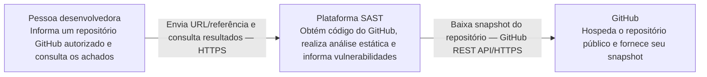
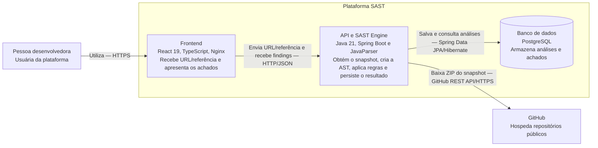
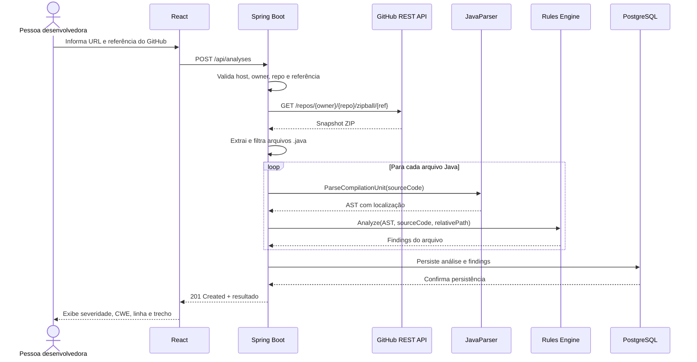

# CP1 — Implementação da Fundação e dos Parsers

> Guia incremental para a primeira entrega da Plataforma SAST.
>
> Documento-base: `CP - Cyber - Documentação de Desenvolvimento.docx`.

## 1. Objetivo da CP1

A CP1 entrega a primeira versão funcional da plataforma de análise estática de segurança. Ao final, uma pessoa desenvolvedora deverá conseguir informar a URL de um repositório público do GitHub, solicitar a análise e receber uma lista de vulnerabilidades encontradas nos arquivos Java pela inspeção de suas ASTs.

O código obtido do GitHub **nunca é executado**. A API baixa um snapshot do repositório, seleciona somente arquivos `.java`, transforma cada arquivo em uma árvore sintática e aplica regras determinísticas. Não são executados `git clone`, instalação de dependências, scripts, builds ou testes do repositório analisado.

### Entregáveis cobertos

| Entregável | Evidência esperada |
|---|---|
| Diagrama de Arquitetura Técnica | Diagramas C4 de contexto e contêineres |
| Ambiente Docker + Docker Compose | `compose.yaml`, Dockerfiles e health checks |
| Repositório estruturado | Monorepo com frontend, backend, engine, testes e documentação |
| Parser funcional | Arquivos Java do repositório convertidos em AST pelo JavaParser |
| Construção da AST | Nós com tipo e localização no código-fonte |
| Rules Engine inicial | Contrato comum e execução independente das regras |
| Três violações iniciais | Credencial hardcoded, `Runtime.exec()` e `ObjectInputStream.readObject()` |
| Demonstração da análise estática | Exemplo reproduzível com três achados |

### Escopo

Incluído na CP1:

- uma única origem: repositórios públicos em `github.com`;
- uma única linguagem analisada: arquivos Java `.java`;
- análise síncrona de um snapshot por requisição;
- tela para URL/referência do GitHub e apresentação do resultado por arquivo;
- persistência dos metadados e achados no PostgreSQL;
- testes automatizados do parser, das regras, do engine e da API.

A extensão autorizada inclui autenticação real com usuários no PostgreSQL, bootstrap por ambiente, tokens JWT Bearer e isolamento das análises por usuário. Consulte [Autenticação e frontend](CP1-Autenticacao-e-Frontend.md) para os contratos atuais e a inicialização da conta.

Ficam para entregas posteriores: dashboard, histórico visual, relatórios, Taint Analysis, IA, sugestões de correção, filas, CI/CD e Security Gates.

## 2. Tecnologias

| Camada | Tecnologia | Responsabilidade |
|---|---|---|
| Frontend | React 19, TypeScript e Vite | Receber a URL do GitHub e exibir os achados |
| API | Java 21 e Spring Boot 4.1 | Baixar o snapshot, validar, orquestrar e expor os resultados |
| Integração | GitHub REST API | Fornecer o archive de um repositório público |
| SAST Engine | Java 21 e JavaParser | Gerar a AST e executar regras de segurança |
| Persistência | Spring Data JPA e PostgreSQL | Salvar análises e vulnerabilidades |
| Infraestrutura | Docker, Compose e Nginx | Executar todo o ambiente de forma reproduzível |
| Testes | JUnit 5, Testcontainers e Vitest | Validar backend, engine e frontend |

JavaParser é uma biblioteca Java que lê código-fonte e produz uma AST Java com nós e localização no código-fonte. A JVM executa somente a plataforma SAST; nenhum compilador Java, classe ou aplicação do repositório analisado será executado.

## 3. Arquitetura C4

C4 significa *Context, Containers, Components e Code*: níveis progressivos de visão da arquitetura. A CP1 documenta os níveis de contexto e contêineres. Embora o Mermaid ofereça a sintaxe C4 nativa, o GitHub não a renderiza; por isso, os diagramas a seguir usam `flowchart`, preservando a semântica C4 e a compatibilidade com o Markdown do GitHub.

### 3.1 Nível 1 — Contexto



### 3.2 Nível 2 — Contêineres



### 3.3 Fluxo interno



## 4. Fase 1 — Criar o monorepo e os esqueletos

### 4.1 Pré-requisitos

- Git;
- JDK 21;
- Maven 3.9 ou superior;
- Node.js em versão LTS e npm;
- Docker Engine com Docker Compose v2.

Validar as instalações:

```bash
git --version
java --version
mvn --version
node --version
npm --version
docker --version
docker compose version
```

### 4.2 Criar o repositório e os diretórios

Executar na pasta que será a raiz do projeto:

```bash
git init
mkdir -p docs docker src/backend/src/{main,test}/java/com/fiap/sast tests
```

Todo o projeto permanece em um único repositório Git. Não devem ser criados repositórios separados dentro de `src/frontend` ou `src/backend`.

### 4.3 Criar o backend Java com Spring Boot

Gerar o projeto pelo Spring Initializr com Maven, Java 21, Spring Web, Validation, Spring Data JPA, PostgreSQL Driver, Flyway e Actuator. O artefato será `sast-api` em `src/backend`.

O `pom.xml` deve usar o parent `spring-boot-starter-parent` 4.1.1, definir `<java.version>21</java.version>` e incluir `spring-boot-starter-web`, `spring-boot-starter-validation`, `spring-boot-starter-data-jpa`, `postgresql`, `flyway-core`, `javaparser-core`, `spring-boot-starter-test` e `org.testcontainers:postgresql` para testes.

Conferir o esqueleto:

```bash
mvn --file src/backend/pom.xml verify
mvn --file src/backend/pom.xml spring-boot:run
```

### 4.4 Criar o frontend React

```bash
npm create vite@latest src/frontend -- --template react-ts
npm --prefix src/frontend install
npm --prefix src/frontend install -D vitest jsdom \
  @testing-library/react @testing-library/jest-dom
npm --prefix src/frontend run dev
```

O frontend possui um único `package.json`. Um workspace npm na raiz não é necessário na CP1 porque existe somente uma aplicação JavaScript.

### 4.5 Configurações compartilhadas

O `.gitignore` da raiz deve conter, no mínimo:

```gitignore
.env
**/target/
**/node_modules/
**/dist/
.idea/
.vscode/
*.log
```

O `.dockerignore` deve impedir o envio de artefatos desnecessários para os builds:

```dockerignore
.git
.env
**/target
**/node_modules
**/dist
*.log
```

O `README.md` da raiz deverá apresentar o objetivo do monorepo, os pré-requisitos, os comandos rápidos de inicialização e um link para este guia.

O `AGENTS.md` da raiz deverá ser lido por qualquer agente Codex antes de alterar o projeto. Ele registrará o escopo da CP1, as regras de segurança para conteúdo obtido do GitHub, os limites arquiteturais entre frontend/API/engine, os comandos de verificação obrigatórios e as funcionalidades explicitamente adiadas para CP2 e CP3. O arquivo não deve conter tokens, senhas ou instruções para executar código baixado.

### 4.6 Estrutura esperada

```text
/
├── docs/
│   └── CP1-Implementacao-Fundacao-e-Parsers.md
├── docker/
│   └── nginx.conf
├── src/
│   ├── frontend/
│   │   ├── src/
│   │   │   ├── api/
│   │   │   ├── components/
│   │   │   ├── types/
│   │   │   ├── App.tsx
│   │   │   └── main.tsx
│   │   ├── Dockerfile
│   │   └── package.json
│   └── backend/
│       ├── src/main/java/com/fiap/sast/
│       │   ├── analysis/ ├── github/ ├── persistence/ ├── rules/ └── web/
│       ├── src/main/resources/db/migration/
│       ├── src/test/java/com/fiap/sast/
│       ├── Dockerfile
│       └── pom.xml
├── samples/
│   └── VulnerableExample.java
├── .dockerignore
├── .env.example
├── .gitignore
├── AGENTS.md
├── compose.yaml
├── README.md
└── pom.xml
```

Responsabilidades:

- `backend`: API HTTP, integração de leitura com GitHub, parsing, regras, persistência e orquestração;
- `frontend`: formulário e visualização dos resultados;
- `tests`: testes separados por unidade arquitetural;
- `samples`: código propositalmente vulnerável usado somente na demonstração;
- `docker`: configuração compartilhada do proxy web;
- `docs`: documentação acadêmica e técnica.

## 5. Fase 2 — Preparar Docker e Docker Compose

### 5.0 Depuração local do backend

O ambiente padrão não expõe a interface de depuração da JVM. Para depurar a API dentro do container, use o override `compose.debug.yaml`:

```bash
docker compose -f compose.yaml -f compose.debug.yaml up --build
```

`compose.debug.yaml` é um override; mantenha o `compose.yaml` no comando para carregar a definição dos serviços.

Esse override habilita JDWP na porta `5005` do container e publica a porta externa somente em `127.0.0.1` (por padrão, `localhost:5005`). A IDE deve usar uma configuração de conexão remota por socket. A aplicação continua iniciando normalmente; altere `suspend=n` para `suspend=y` no override apenas quando for necessário depurar o início da aplicação.

### 5.1 Dockerfile da API

Criar `src/backend/Dockerfile` com build multi-stage.

```dockerfile
FROM maven:3.9-eclipse-temurin-21 AS build
WORKDIR /app
COPY src/backend/pom.xml .
RUN mvn dependency:go-offline
COPY src/backend/src src
RUN mvn package -DskipTests

FROM eclipse-temurin:21-jre
RUN apt-get update && apt-get install -y --no-install-recommends curl && rm -rf /var/lib/apt/lists/*
WORKDIR /app
COPY --from=build /app/target/*.jar app.jar
EXPOSE 8080
ENTRYPOINT ["java", "-jar", "app.jar"]
```

### 5.2 Dockerfile do frontend

Criar `src/frontend/Dockerfile`:

```dockerfile
FROM node:24-alpine AS build
WORKDIR /app
COPY src/frontend/package*.json ./
RUN npm ci
COPY src/frontend/ .
RUN npm run build

FROM nginx:1.29-alpine
COPY --from=build /app/dist /usr/share/nginx/html
COPY docker/nginx.conf /etc/nginx/conf.d/default.conf
EXPOSE 80
```

Como o `nginx.conf` está fora da pasta do frontend, o Compose também usará a raiz do monorepo como contexto desse build.

### 5.3 Proxy Nginx

Criar `docker/nginx.conf`:

```nginx
server {
    listen 80;
    server_name _;

    root /usr/share/nginx/html;
    index index.html;

    location /api/ {
        proxy_pass http://api:8080;
        proxy_set_header Host $host;
        proxy_set_header X-Forwarded-For $proxy_add_x_forwarded_for;
        proxy_set_header X-Forwarded-Proto $scheme;
    }

    location /health {
        proxy_pass http://api:8080/health;
    }

    location / {
        try_files $uri /index.html;
    }
}
```

O proxy permite que o frontend use URLs relativas como `/api/analyses`, evitando uma configuração de CORS na execução via Compose.

### 5.4 Variáveis de ambiente

Criar `.env.example` sem credenciais reais:

```dotenv
POSTGRES_DB=sast
POSTGRES_USER=sast
POSTGRES_PASSWORD=change-me
WEB_PORT=3000
API_PORT=8080
GITHUB_TOKEN=
SAST_BOOTSTRAP_EMAIL=
SAST_BOOTSTRAP_PASSWORD=
SAST_COOKIE_SECURE=false
```

`GITHUB_TOKEN` é opcional na CP1, pois o endpoint de archive aceita acesso anônimo a repositórios públicos. Quando preenchido, deve ser um token fine-grained somente leitura, mantido exclusivamente no backend. Ele nunca deve ser enviado ao frontend, persistido ou incluído em logs.

Copiar para `.env` somente no ambiente local:

```bash
cp .env.example .env
```

Adicionar `.env` ao `.gitignore`.

Antes de iniciar, preencher e-mail e senha bootstrap no `.env` local. Em banco vazio, a senha deve ter pelo menos 12 caracteres e no máximo 72 bytes UTF-8. A conta é criada uma única vez; não há senha padrão. Em HTTPS, usar `SAST_COOKIE_SECURE=true`.

### 5.5 Compose da raiz

Criar `compose.yaml`:

```yaml
services:
  db:
    image: postgres:18-alpine
    environment:
      POSTGRES_DB: ${POSTGRES_DB}
      POSTGRES_USER: ${POSTGRES_USER}
      POSTGRES_PASSWORD: ${POSTGRES_PASSWORD}
    volumes:
      - postgres_data:/var/lib/postgresql
    healthcheck:
      test: ["CMD-SHELL", "pg_isready -U ${POSTGRES_USER} -d ${POSTGRES_DB}"]
      interval: 5s
      timeout: 5s
      retries: 10

  api:
    build:
      context: .
      dockerfile: src/backend/Dockerfile
    environment:
      SPRING_PROFILES_ACTIVE: development
      SPRING_DATASOURCE_URL: >-
        jdbc:postgresql://db:5432/${POSTGRES_DB}
      SPRING_DATASOURCE_USERNAME: ${POSTGRES_USER}
      SPRING_DATASOURCE_PASSWORD: ${POSTGRES_PASSWORD}
      SAST_GITHUB_TOKEN: ${GITHUB_TOKEN:-}
      SAST_BOOTSTRAP_EMAIL: ${SAST_BOOTSTRAP_EMAIL:-}
      SAST_BOOTSTRAP_PASSWORD: ${SAST_BOOTSTRAP_PASSWORD:-}
      SAST_COOKIE_SECURE: ${SAST_COOKIE_SECURE:-false}
      SAST_GITHUB_MAX_ARCHIVE_BYTES: 10485760
      SAST_GITHUB_MAX_JAVA_FILES: 200
      SAST_GITHUB_MAX_FILE_BYTES: 1048576
    ports:
      - "${API_PORT}:8080"
    depends_on:
      db:
        condition: service_healthy
    healthcheck:
      test: ["CMD", "curl", "--fail", "http://localhost:8080/health"]
      interval: 5s
      timeout: 5s
      retries: 10

  web:
    build:
      context: .
      dockerfile: src/frontend/Dockerfile
    ports:
      - "${WEB_PORT}:80"
    depends_on:
      api:
        condition: service_healthy

volumes:
  postgres_data:
```

## 6. Fase 3 — Implementar a persistência mínima

### 6.1 Modelo de dados

`Analysis` é uma entidade JPA com UUID, URL, owner, repositório, referência, linguagem, quantidade de arquivos, estado, data de criação e lista de `Finding`. `Finding` é uma entidade JPA vinculada à análise e contém UUID, regra, título, severidade, CWE, descrição, arquivo, linha, coluna e trecho.

Não incluir o archive nem o conteúdo integral dos arquivos no banco. O snapshot existe apenas em memória durante a requisição; somente URL, referência, metadados da análise e o trecho relacionado a cada achado são persistidos. A migration V2 adiciona usuários e proprietário da análise; registros legados permanecem inacessíveis.

### 6.2 Entidades JPA e migrations

Criar entidades JPA em `persistence/entity` e repositórios `JpaRepository` em `persistence/repository`. `Analysis` possui relação `@OneToMany(cascade = CascadeType.ALL)` com `Finding`; UUID, URL, proprietário, repositório, referência, linguagem, data, estado e contagem são persistidos. `Finding` armazena regra, severidade, CWE, arquivo, linha, coluna e trecho.

Criar `src/backend/src/main/resources/db/migration/V1__initial_schema.sql` com o schema. O Flyway aplica a migration na inicialização. Para a CP1 isso é adequado; em produção, migrations devem ser controladas na implantação.

Essa conveniência é adequada para a demonstração. Em produção, migrations devem ser uma etapa controlada de implantação.

## 7. Fase 4 — Obter o código do GitHub e construir as ASTs

### 7.1 Limites da integração GitHub

A CP1 aceitará somente URLs no formato `https://github.com/{owner}/{repository}`, com `.git` opcional no final. Rejeitar:

- HTTP sem TLS, hosts diferentes de `github.com`, subdomínios e endereços IP;
- URL com usuário, senha, porta, query string ou fragmento;
- owner ou repository vazios;
- referências contendo `..`, barras invertidas ou caracteres de controle.

O backend transformará a URL validada no endpoint oficial `GET /repos/{owner}/{repo}/zipball/{ref}`. Owner, repository e referência devem ser codificados como segmentos de URL. Se `reference` estiver vazio, será usado o endpoint sem `{ref}`, que baixa o branch padrão. Configurar `AllowAutoRedirect = false`, validar o `Location` da resposta `302` e realizar o segundo GET somente quando o host for exatamente `codeload.github.com`.

Para manter o processamento controlado:

- limitar o ZIP baixado a 10 MiB;
- analisar no máximo 200 arquivos Java;
- limitar cada arquivo a 1 MiB;
- ignorar links simbólicos e entradas ZIP que escapem do diretório temporário;
- ignorar diretórios gerados ou de dependências, como `target`, `build`, `out`, `.gradle`, `node_modules` e `vendor`;
- manter o snapshot somente em memória e fechar os streams com try-with-resources. Se arquivos temporários forem introduzidos futuramente, apagá-los em `finally`.

Esses limites devem vir de configuração e resultar em HTTP `413` quando excedidos.

### 7.2 Contrato do cliente GitHub

Em `src/backend/src/main/java/com/fiap/sast/github/GitHubClient.java`, manter o cliente:

O cliente retorna um `RepositorySnapshot` com metadados e `List<RepositorySourceFile> javaFiles`; a interface `GitHubRepositoryClient` expõe `RepositorySnapshot download(String repositoryUrl, String reference)`.

Registrar um typed `HttpClient` com base `https://api.github.com`, `User-Agent`, `Accept: application/vnd.github+json` e timeout. Adicionar `Authorization: Bearer` somente quando `GitHub:Token` estiver preenchido. A API pública pode ser usada sem token, porém requisições não autenticadas estão limitadas a 60 por hora por endereço IP; o token opcional aumenta o limite e continua restrito ao backend.

O cliente deve mapear:

- GitHub `404` para repositório ou referência inexistente;
- GitHub `403`/`429` para indisponibilidade por rate limit, preservando `Retry-After` quando existir;
- timeout ou falha de rede para `502 Bad Gateway`;
- archive vazio ou sem `.java` para `422 Unprocessable Entity`.

### 7.3 Contrato do parser

Em `src/backend/src/main/java/com/fiap/sast/parsing`, manter o contrato:

```java
public interface JavaSourceParser {
    CompilationUnit parse(String sourceCode);
}
```

### 7.4 Implementação com JavaParser

```java
public final class JavaParserSourceParser implements JavaSourceParser {
    private final JavaParser parser = new JavaParser();

    public CompilationUnit parse(String sourceCode) {
        ParseResult<CompilationUnit> result = parser.parse(sourceCode);
        if (result.getResult().isEmpty()) throw InvalidJavaSourceException.from(result.getProblems());
        return result.getResult().orElseThrow();
    }
}
```

Usar `com.github.javaparser:javaparser-core`. O `CompilationUnit` já é a AST Java; regras visitam seus nós e usam `node.getRange()` para linha e coluna, sem compilação ou execução.

Uma entrada simples:

```java
final String password = "123456";
```

produz uma árvore equivalente a:

```text
CompilationUnit
└── FieldDeclaration
    └── VariableDeclarator
        ├── Identifier: password
        └── StringLiteral: "123456"
```

Durante o desenvolvimento, a AST interna pode ser serializada somente em testes ou depuração local para demonstrar sua estrutura. A AST não será devolvida pela API nem persistida.

### 7.5 Erro de sintaxe

Encapsular os problemas retornados pelo JavaParser em `InvalidJavaSourceException`, preservando mensagem, linha e coluna. O controller usa `ProblemDetail` do Spring para responder HTTP `422 Unprocessable Entity`.

## 8. Fase 5 — Implementar o Rules Engine

### 8.1 Modelo de saída do engine

```java
public record SecurityFinding(String ruleId, String title, String severity,
    String cwe, String description, String fileName, int line, int column, String snippet) {}
```

### 8.2 Contrato de regra

```java
public interface SecurityRule {
    String ruleId();
    List<SecurityFinding> analyze(CompilationUnit ast, String sourceCode, String fileName);
}
```

Cada regra deve visitar somente os nós da AST Java de seu interesse e emitir `SecurityFinding`. Uma função compartilhada extrairá linha e coluna do nó, normalizando a coluna para começar em 1 na resposta.

### 8.3 Regra 1 — Credencial hardcoded

Metadados:

| Campo | Valor |
|---|---|
| Rule ID | `SAST-JAVA-001` |
| Título | Hardcoded credential |
| Severidade | Critical |
| CWE | CWE-798 |

Detectar `VariableDeclarator` e atribuições quando:

- o nome do identificador ou propriedade corresponder, sem diferenciar maiúsculas, a `password`, `passwd`, `pwd`, `secret`, `apiKey` ou `token`;
- o valor atribuído for um literal textual não vazio.

Exemplos detectados:

```java
String password = "123456";
config.apiKey = "abc-123";
```

Exemplos que não devem gerar finding:

```java
String password = System.getenv("PASSWORD");
String password = secretProvider.getSecret();
```

### 8.4 Regra 2 — Uso de `Runtime.exec()`

Metadados:

| Campo | Valor |
|---|---|
| Rule ID | `SAST-JAVA-002` |
| Título | Uso potencialmente inseguro de Runtime.exec |
| Severidade | High |
| CWE | CWE-78 |

Visitar invocações de método e detectar `Runtime.getRuntime().exec(...)`. Nesta primeira versão, qualquer chamada a esse método gera finding; o rastreamento de origem e sanitização do argumento fica para uma entrega posterior.

```java
Runtime.getRuntime().exec(userInput); // detectar
process.execute(userInput);            // não detectar nesta versão
```

### 8.5 Regra 3 — Desserialização com `ObjectInputStream.readObject()`

Metadados:

| Campo | Valor |
|---|---|
| Rule ID | `SAST-JAVA-003` |
| Título | Desserialização potencialmente insegura |
| Severidade | High |
| CWE | CWE-502 |

Visitar invocações de método e detectar chamadas a `readObject()` cujo receptor tenha tipo declarado `ObjectInputStream`. Nesta primeira versão, toda chamada correspondente gera finding; a validação da origem do fluxo e o uso de filtros de desserialização pertencem à análise semântica posterior.

```java
ObjectInputStream input = new ObjectInputStream(stream);
Object value = input.readObject();  // detectar
input.readUTF();                    // não detectar
```

Na CP1, a regra reporta toda chamada correspondente. Análise de fluxo de dados pertence ao Taint Analysis da CP2.

### 8.6 Orquestrador

```java
@Service
public final class SastEngine {
    private final JavaSourceParser parser;
    private final List<SecurityRule> rules;
    public List<SecurityFinding> analyze(String sourceCode, String fileName) {
        var ast = parser.parse(sourceCode);
        return rules.stream().flatMap(rule -> rule.analyze(ast, sourceCode, fileName).stream())
            .sorted(comparing(SecurityFinding::line).thenComparing(SecurityFinding::column))
            .toList();
    }
}
```

Registrar parser, regras e engine como beans do Spring. As regras devem ser componentes individuais que implementem `SecurityRule`.

## 9. Fase 6 — Implementar a API

### 9.1 Contratos HTTP

Requisição de `POST /api/analyses`:

```json
{
  "repositoryUrl": "https://github.com/SEU_USUARIO/cp1-sast",
  "reference": "main"
}
```

Campos obrigatórios:

- `repositoryUrl`: URL HTTPS de um repositório público em `github.com`.

Campo opcional:

- `reference`: branch, tag ou SHA. Quando omitido, o GitHub usa o branch padrão do repositório.

Resposta compartilhada por `POST /api/analyses` e `GET /api/analyses/{id}`:

```json
{
  "analysisId": "2eced20f-0a5b-452b-a95d-21d39f936699",
  "status": "Completed",
  "repositoryUrl": "https://github.com/SEU_USUARIO/cp1-sast",
  "reference": "main",
  "language": "java",
  "filesAnalyzed": 1,
  "createdAt": "2026-09-03T22:00:00Z",
  "findings": [
    {
      "ruleId": "SAST-JAVA-001",
      "title": "Hardcoded credential",
      "severity": "Critical",
      "cwe": "CWE-798",
      "description": "Credencial armazenada diretamente no código-fonte.",
      "fileName": "samples/VulnerableExample.java",
      "line": 6,
      "column": 5,
      "snippet": "private static final String password = \"123456\";"
    }
  ]
}
```

### 9.2 Endpoint de criação

`POST /api/analyses` deverá:

1. validar e normalizar a URL do GitHub e a referência opcional;
2. chamar `IGitHubRepositoryClient.DownloadAsync`;
3. filtrar os arquivos Java e seus limites;
4. chamar `ISastEngine.Analyze` uma vez para cada arquivo, usando o caminho relativo como `fileName`;
5. agregar e ordenar os findings por arquivo, linha, coluna e regra;
6. mapear o resultado para as entidades JPA;
7. salvar `Analysis` e `Finding` em uma transação;
8. descartar o snapshot em memória ao concluir a requisição;
9. retornar `201 Created`, incluindo `Location: /api/analyses/{id}`.

### 9.3 Endpoint de consulta

`GET /api/analyses/{id}` carregará a análise e seus findings pelo repositório Spring Data JPA, filtrando também pelo usuário autenticado:

- retornar `200 OK` quando encontrada;
- retornar `404 Not Found` quando o identificador não existir, pertencer a outro usuário ou for um registro legado sem proprietário.

POST e GET exigem cookie de sessão autenticada. Todos os POST também exigem o header retornado por GET /api/auth/csrf. Autenticação ausente/expirada retorna 401 e CSRF inválido retorna 403 em JSON. Os DTOs usam `analysisId` e não expõem entidades de usuário.

### 9.4 Tratamento de falhas

| Situação | Status | Resposta |
|---|---:|---|
| URL ausente ou formato/host inválido | 400 | `ValidationProblemDetails` |
| Referência inválida | 400 | `ValidationProblemDetails` |
| Repositório ou referência inexistente | 404 | `ProblemDetails` |
| Archive vazio ou sem Java | 422 | `ProblemDetails` |
| Java sintaticamente inválido | 422 | `ProblemDetails` com arquivo, linha e coluna |
| Limite de archive/arquivos/tamanho excedido | 413 | `ProblemDetails` |
| Rate limit do GitHub | 429 | `ProblemDetails` e `Retry-After`, quando disponível |
| GitHub indisponível ou timeout | 502 | `ProblemDetails` |
| Análise não encontrada | 404 | `ProblemDetails` |
| Erro inesperado | 500 | `ProblemDetails` sem stack trace |

Adicionar `GET /health` pelo Spring Boot Actuator. O health check será usado pelo Compose e não fará parte da interface de negócio.

## 10. Fase 7 — Implementar o frontend da CP1

### 10.1 Tipos

Em `src/frontend/src/types/analysis.ts`:

```typescript
export type Severity = 'Low' | 'Medium' | 'High' | 'Critical'

export interface AnalysisRequest {
  repositoryUrl: string
  reference?: string
}

export interface Finding {
  ruleId: string
  title: string
  severity: Severity
  cwe: string
  description: string
  fileName: string
  line: number
  column: number
  snippet: string
}

export interface AnalysisResponse {
  analysisId: string
  status: 'Completed'
  repositoryUrl: string
  reference?: string
  language: 'java'
  filesAnalyzed: number
  createdAt: string
  findings: Finding[]
}
```

### 10.2 Cliente HTTP

O frontend chamará a API com caminho relativo:

```typescript
export async function createAnalysis(
  request: AnalysisRequest,
): Promise<AnalysisResponse> {
  const csrfResponse = await fetch('/api/auth/csrf', { credentials: 'same-origin' })
  if (!csrfResponse.ok) throw new Error('Não foi possível iniciar a solicitação')
  const csrf = await csrfResponse.json()
  const response = await fetch('/api/analyses', {
    method: 'POST',
    credentials: 'same-origin',
    headers: { 'Content-Type': 'application/json', [csrf.headerName]: csrf.token },
    body: JSON.stringify(request),
  })

  if (!response.ok) {
    const problem = await response.json()
    throw new Error(problem.detail ?? problem.title ?? 'Falha ao analisar o código')
  }

  return response.json()
}
```

Para o servidor local do Vite, configurar um proxy em `vite.config.ts`:

```typescript
server: {
  proxy: {
    '/api': 'http://localhost:8080',
  },
}
```

### 10.3 Componentes

Dividir a tela em componentes simples:

- `AnalysisForm`: URL do GitHub, referência opcional e botão “Analisar repositório”;
- `AnalysisSummary`: repositório, referência, arquivos analisados, total de achados e contagem por severidade;
- `FindingGroup`: agrupa os achados pelo caminho do arquivo;
- `FindingCard`: título, badge de severidade, CWE, posição, trecho e descrição;
- `ErrorMessage`: mensagem retornada pela API;
- `LoadingIndicator`: estado enquanto a requisição está em andamento.

Fluxo de estado do `App`:

```text
idle -> loading -> success
               -> error
```

Enquanto estiver em `loading`, desabilitar o botão para impedir envios duplicados. Uma análise sem achados deve mostrar uma mensagem de sucesso, e não uma área vazia.

A extensão autorizada adiciona rotas `/login`, `/analyses/new` e `/analyses/:analysisId`, restauração de sessão, processamento e detalhes expansíveis. O mockup é adaptado à entrada de repositório público Java. Dashboard continua fora desta fase.

## 11. Fase 8 — Testes automatizados

### 11.1 Integração GitHub

- aceitar somente URLs HTTPS com host exato `github.com`;
- normalizar `.git` e barra final sem alterar owner/repository;
- construir corretamente o endpoint de archive com e sem referência;
- seguir somente o redirecionamento esperado para `codeload.github.com`;
- extrair caminhos relativos sem permitir Zip Slip;
- ignorar diretórios gerados/de dependências e extensões diferentes de `.java`;
- rejeitar archive, quantidade de arquivos e arquivo individual acima dos limites;
- mapear `404`, rate limit e timeout sem expor o token.

Os testes usarão um cliente HTTP falso e archives ZIP criados em memória. Não dependerão da rede nem consumirão o rate limit real do GitHub.

### 11.2 Parser

- código válido retorna `CompilationUnit` com declarações;
- a localização do primeiro nó aponta para a linha correta;
- código inválido lança `InvalidJavaSourceException` com linha e coluna;
- o teste confirma que a análise não inicia subprocessos como `javac`, `java`, Maven ou Gradle sobre o código analisado.

### 11.3 Regras

Cada regra deve possuir ao menos um caso positivo e um negativo:

| Regra | Positivo | Negativo |
|---|---|---|
| Hardcoded credential | `String password = "123"` | `String password = System.getenv("PASSWORD")` |
| Runtime.exec | `Runtime.getRuntime().exec(input)` | `process.execute(input)` |
| ObjectInputStream.readObject | `input.readObject()` | `input.readUTF()` |

Adicionar testes para a cadeia completa `Runtime.getRuntime().exec(...)`, a tipagem de `ObjectInputStream` e nomes de credencial com diferenças de maiúsculas.

### 11.4 Engine

- executar as três regras registradas;
- ordenar findings por linha, coluna e `ruleId`;
- retornar lista vazia para código sem os padrões definidos;
- retornar exatamente três achados para o exemplo da demonstração.

### 11.5 API

Usar `@SpringBootTest`, substituir a conexão normal por um PostgreSQL efêmero com Testcontainers e trocar `GitHubRepositoryClient` por um fake determinístico. O teste deverá iniciar o container, fornecer a URL JDBC, aplicar as migrations e descartá-lo ao final. Validar:

- `POST` válido retorna `201` e cabeçalho `Location`;
- o registro e seus findings foram persistidos;
- `GET` recupera o mesmo resultado;
- entradas inválidas retornam `400`;
- sintaxe inválida retorna `422`;
- falhas e limites do GitHub são mapeados para `404`, `413`, `429` ou `502`;
- identificador desconhecido retorna `404`.

### 11.6 Frontend

Com Vitest e Testing Library, validar:

- o formulário envia `repositoryUrl` e a referência opcional;
- o botão fica desabilitado durante o carregamento;
- uma resposta com findings cria os cards;
- uma lista vazia mostra “Nenhuma vulnerabilidade encontrada”;
- um `ProblemDetails` é apresentado como erro legível.

Executar tudo a partir da raiz:

```bash
mvn --file src/backend/pom.xml verify
npm --prefix src/frontend run test -- --run
npm --prefix src/frontend run build
```

## 12. Fase 9 — Demonstração da análise estática

### 12.1 Subir o ambiente

```bash
cp .env.example .env
docker compose up --build
docker compose ps
```

Resultados esperados:

- frontend: `http://localhost:3000`;
- API/OpenAPI: `http://localhost:8080`;
- health check: `http://localhost:8080/health`;
- serviços `db`, `api` e `web` em estado saudável.

### 12.2 Repositório vulnerável oficial da CP1

Criar `samples/VulnerableExample.java` no próprio monorepo com exatamente este conteúdo e publicar o repositório como público no GitHub:

```java
import java.io.InputStream;
import java.io.ObjectInputStream;
public final class VulnerableExample {
    private static final String password = "123456";
    public Object execute(String userInput, InputStream stream) throws Exception {
        Runtime.getRuntime().exec(userInput);
        ObjectInputStream input = new ObjectInputStream(stream);
        return input.readObject();
    }
}
```

Depois da publicação, entrar no frontend com a conta bootstrap e informar a URL pública do monorepo e a referência publicada (neste repositório, `master`). Para chamadas pelo terminal, autenticar primeiro, manter o cookie JSESSIONID e enviar o header CSRF atual. O corpo da análise continua:

```bash
curl --request POST http://localhost:8080/api/analyses \
  --cookie cookies.txt \
  --header "X-CSRF-TOKEN: $SAST_CSRF_TOKEN" \
  --header 'Content-Type: application/json' \
  --data '{
    "repositoryUrl": "https://github.com/SEU_USUARIO/cp1-sast",
    "reference": "master"
  }'
```

### 12.3 Resultado esperado

| Ordem | Arquivo | Regra | Severidade | CWE | Linha |
|---:|---|---|---|---|---:|
| 1 | `samples/VulnerableExample.java` | Hardcoded credential | Critical | CWE-798 | 4 |
| 2 | `samples/VulnerableExample.java` | Uso potencialmente inseguro de Runtime.exec | High | CWE-78 | 6 |
| 3 | `samples/VulnerableExample.java` | Desserialização potencialmente insegura | High | CWE-502 | 8 |

A demonstração deve mostrar:

1. a URL e a referência no formulário;
2. o download do snapshot sem clonar ou executar o repositório;
3. o estado de processamento;
4. os três cards agrupados em `samples/VulnerableExample.java`;
5. linha e trecho corretos;
6. a análise persistida no PostgreSQL;
7. a aplicação continuando saudável após analisar o snapshot.

O repositório contém código Java perigoso de propósito, porém seus arquivos nunca devem ser compilados, carregados ou encaminhados a shell, Maven, Gradle ou subprocesso externo.

## 13. Checklist de entrega

### Arquitetura e repositório

- [x] Existe apenas um repositório Git.
- [x] Frontend, API, engine, testes, amostra, Docker e documentação estão separados por diretório.
- [x] `README.md` explica o projeto, a inicialização e aponta para a documentação da CP1.
- [x] `AGENTS.md` define as regras que o Codex deve ler antes de alterar o monorepo.
- [x] Os diagramas C4 de contexto e contêineres renderizam corretamente.
- [ ] `mvn --file src/backend/pom.xml verify` conclui sem erros.
- [x] `npm --prefix src/frontend run build` conclui sem erros.

### Docker

- [x] `.env.example` não contém segredo real.
- [x] `docker compose up --build` inicia os três serviços.
- [x] Banco e API possuem health checks.
- [x] O frontend acessa a API por `/api`.
- [x] O volume mantém os dados após reiniciar os containers.

### Integração GitHub

- [ ] O frontend recebe URL pública e referência opcional.
- [ ] A API aceita somente URLs válidas de `github.com`.
- [ ] O snapshot é obtido pela GitHub REST API e removido após a análise.
- [ ] Somente arquivos `.java` elegíveis são analisados.
- [ ] Archives e arquivos acima dos limites são rejeitados.
- [ ] O token opcional existe somente no backend e nunca aparece em logs.

### Parser, AST e regras

- [x] Java válido gera AST com localização.
- [x] Java inválido retorna `422`.
- [x] Nenhum código baixado do GitHub é executado.
- [x] As três regras possuem testes positivos e negativos.
- [x] Cada finding apresenta regra, severidade, CWE, arquivo, linha, coluna e trecho.

### API, banco e frontend

- [x] `POST /api/analyses` retorna `201 Created`.
- [x] `GET /api/analyses/{id}` retorna a análise salva.
- [x] O archive e o código completo não são persistidos.
- [x] O frontend trata carregamento, sucesso sem achados e erro.
- [x] O exemplo oficial produz exatamente três findings.

## 14. Critério de conclusão da CP1

A CP1 estará concluída quando um clone limpo do monorepo puder ser iniciado com Docker Compose, receber pelo frontend a URL pública do repositório de demonstração, baixar seu snapshot, analisar `samples/VulnerableExample.java`, aplicar as três regras, persistir os achados e apresentar exatamente três vulnerabilidades sem executar qualquer código do repositório.

## Referências técnicas

- [Spring Boot](https://spring.io/projects/spring-boot)
- [JavaParser](https://javaparser.org/)
- [React: criação de uma aplicação com Vite](https://react.dev/learn/build-a-react-app-from-scratch)
- [CWE-78 — OS Command Injection](https://cwe.mitre.org/data/definitions/78.html)
- [CWE-502 — Deserialization of Untrusted Data](https://cwe.mitre.org/data/definitions/502.html)
- [CWE-798 — Hard-coded Credentials](https://cwe.mitre.org/data/definitions/798.html)
- [GitHub REST API — Download de archive do repositório](https://docs.github.com/en/rest/repos/contents#download-a-repository-archive-zip)
- [GitHub REST API — Rate limits](https://docs.github.com/en/rest/using-the-rest-api/rate-limits-for-the-rest-api)
