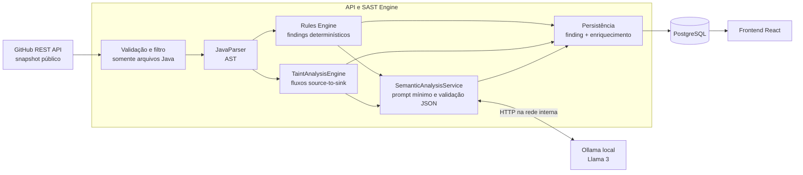

# ADR-001 — IA local e análise semântica da CP2

- **Status:** Aceita
- **Data:** 2026-09-14
- **Responsáveis:** Equipe da Plataforma SAST
- **Checkpoint:** CP2 — IA e Análise Semântica
- **Aceite:** 2026-09-24 — implementação e testes descritos em [CP2 — IA local](../CP2-IA-Local.md). A prova com `llama3.2:3b` avaliou três findings de um fixture Java e um finding de taint com trace; o `mvn verify` e os testes do frontend passaram.

## Contexto

A CP1 estabeleceu um fluxo síncrono para baixar o snapshot de um repositório público do GitHub, selecionar arquivos Java, construir suas ASTs com JavaParser, executar regras determinísticas e persistir os findings. Essa base identifica padrões estruturais, mas não confirma se um valor controlado externamente realmente alcança uma operação sensível nem produz orientação contextual de correção.

A CP2 deverá acrescentar:

- Taint Analysis para acompanhar dados não confiáveis até funções sensíveis;
- análise semântica com um LLM executado localmente;
- classificação consultiva para ajudar a reconhecer prováveis falsos positivos;
- sugestões de remediação;
- uma demonstração reproduzível de varredura semântica.

As garantias de segurança da CP1 continuam obrigatórias: o código analisado nunca será executado, compilado ou enviado a um serviço externo; archives e fontes integrais não serão persistidos; e a análise continuará restrita a arquivos Java de repositórios públicos em `github.com`.

## Decisão

A plataforma será estendida com dois estágios independentes e ordenados depois do parsing da AST:

1. um mecanismo determinístico e intraprocedural de Taint Analysis;
2. um enriquecimento consultivo por um modelo Llama 3 servido localmente pelo Ollama.

Os findings determinísticos permanecem como fonte de verdade. O LLM não poderá criar, excluir ou alterar um finding, nem aplicar correções no repositório. Sua resposta será armazenada e apresentada como uma avaliação separada, identificada explicitamente como conteúdo gerado por IA.

A requisição de análise permanecerá síncrona na CP2. Filas e processamento assíncrono continuam adiados.

## Arquitetura decidida



### Limites dos componentes

- `TaintAnalysisEngine` receberá a AST, o conteúdo transitório e o caminho relativo. Ele não conhecerá HTTP, GitHub, Ollama ou JPA.
- Catálogos independentes definirão sources, sinks e sanitizers. Novas definições deverão ser registráveis sem alterar o algoritmo de propagação.
- `SemanticAnalysisService` receberá apenas findings candidatos e traces já calculados. Ele será responsável por limitar o contexto, chamar o Ollama, validar a resposta e informar o estado do enriquecimento.
- O `SastEngine` continuará responsável pela análise determinística. A orquestração da API combinará seus findings com o resultado do Taint Analysis e com o enriquecimento opcional.
- O frontend continuará acessando somente os contratos HTTP autenticados e nunca terá acesso direto ao Ollama, ao banco ou ao código-fonte completo.

## Escopo inicial do Taint Analysis

A primeira versão será intraprocedural: um fluxo começa e termina dentro do mesmo método ou inicializador. Chamadas entre métodos, classes ou módulos não serão seguidas nesta etapa.

O mecanismo deverá acompanhar, dentro do escopo analisado:

- inicialização e reatribuição de variáveis;
- concatenação de strings;
- expressões condicionais simples;
- passagem de valores como argumentos para chamadas de método;
- perda de taint somente quando o valor atravessar um sanitizer explicitamente cadastrado.

O primeiro cenário vertical será command injection. Entradas obtidas de APIs HTTP reconhecidas, incluindo parâmetros de Servlet e parâmetros de controllers Spring, serão sources. Chamadas a `Runtime.exec()` e criação/execução de `ProcessBuilder` serão sinks. Os catálogos serão extensíveis para SQL injection, acesso a arquivos e outros CWEs sem acoplar essas categorias ao algoritmo.

Não haverá presunção de sanitização pelo nome de um método. Um sanitizer precisará estar no catálogo da regra e possuir teste que demonstre o comportamento aceito.

Cada fluxo confirmado produzirá um `taintTrace` com:

- identificação e posição da source;
- etapas ordenadas de propagação;
- identificação e posição do sink;
- arquivo, linha e coluna de cada etapa;
- versão do engine de taint que produziu o resultado.

## Integração com Ollama

O Ollama será executado como serviço local na rede interna do Docker Compose, sem publicação de sua porta no host por padrão. Um volume nomeado preservará o modelo entre inicializações. O modelo será configurado por `SAST_OLLAMA_MODEL`, usando `llama3.2:3b` como padrão inicial, e o endereço interno por `SAST_OLLAMA_BASE_URL`, cujo padrão será `http://ollama:11434`.

A indisponibilidade do Ollama não impedirá a inicialização da API. Para cada chamada serão realizadas no máximo duas tentativas no total, cada uma com timeout de 20 segundos. A segunda tentativa ocorrerá somente para timeout, erro de conexão ou resposta HTTP transitória. Depois disso, a análise será concluída com os findings determinísticos e `semanticStatus: DEGRADED`.

O prompt conterá somente:

- metadados do finding;
- o trace de taint, quando disponível;
- o menor trecho do método necessário para contextualizar o finding;
- instruções fixas de saída e a versão do prompt.

Código-fonte, prompts e respostas brutas não serão registrados em logs. O conteúdo do repositório será tratado como dado não confiável e nunca como instrução para o modelo.

A resposta deverá obedecer a um esquema JSON fechado com os campos:

- `confidence`: número entre 0 e 1;
- `suggestedSeverity`: `Low`, `Medium`, `High` ou `Critical`;
- `likelyFalsePositive`: booleano;
- `rationale`: justificativa curta;
- `remediation`: orientação e exemplo de correção.

Campos adicionais, valores fora do domínio, JSON inválido ou resposta vazia tornarão o enriquecimento indisponível. A saída não será executada nem aplicada automaticamente.

## Contratos HTTP

Os endpoints existentes serão preservados. A alteração será aditiva no DTO retornado por `POST /api/analyses` e `GET /api/analyses/{id}`.

No nível da análise será acrescentado:

```json
{
  "semanticStatus": "COMPLETED | DEGRADED | NOT_APPLICABLE"
}
```

Cada finding poderá conter:

```json
{
  "taintTrace": {
    "engineVersion": "string",
    "source": { "kind": "string", "line": 1, "column": 1 },
    "steps": [
      { "kind": "string", "line": 2, "column": 1 }
    ],
    "sink": { "kind": "string", "line": 3, "column": 1 }
  },
  "aiAssessment": {
    "model": "string",
    "promptVersion": "string",
    "confidence": 0.9,
    "suggestedSeverity": "High",
    "likelyFalsePositive": false,
    "rationale": "string",
    "remediation": "string"
  }
}
```

`taintTrace` e `aiAssessment` serão opcionais para manter compatibilidade com findings puramente estruturais e análises degradadas. `NOT_APPLICABLE` indicará que nenhum finding era elegível para enriquecimento; `COMPLETED`, que todos os candidatos foram processados; e `DEGRADED`, que ao menos um candidato não pôde ser enriquecido.

## Persistência e identidade da execução

Os dados determinísticos continuarão na entidade de finding existente. Trace e avaliação de IA serão persistidos separadamente e associados ao finding, para preservar sua origem e permitir evolução do contrato sem misturar fatos determinísticos com inferências.

O enriquecimento persistirá, no mínimo:

- trace e versão do engine de taint;
- estado do processamento semântico;
- nome do modelo e versão do prompt;
- confiança, severidade sugerida e indicador de provável falso positivo;
- justificativa e remediação limitadas por tamanho.

O archive e o código-fonte integral não serão persistidos. O trecho de contexto enviado ao modelo continuará transitório em memória.

A identidade usada para reutilizar uma execução deverá considerar, além dos findings determinísticos, a versão do engine de taint, o nome do modelo e a versão do prompt. Uma mudança em qualquer desses elementos exigirá novo enriquecimento e não poderá reutilizar silenciosamente uma avaliação antiga.

## Segurança e observabilidade

- Nenhuma etapa poderá compilar ou executar o código analisado.
- Ollama e PostgreSQL permanecerão inacessíveis ao frontend.
- Tokens, código-fonte, prompts e respostas brutas serão excluídos dos logs.
- Logs estruturados registrarão somente identificadores, durações, quantidade de candidatos, número da tentativa e estado final.
- Tamanho do contexto, tamanho da resposta e quantidade de candidatos serão limitados por configuração.
- Falhas semânticas não alterarão severidade nem ocultarão findings determinísticos.
- Remediações serão exibidas como sugestão e nunca gravadas no repositório analisado.

## Consequências

### Positivas

- O Taint Analysis fornece evidência reproduzível de fluxo, reduzindo dependência de avaliação probabilística.
- O LLM acrescenta contexto e remediação sem controlar o resultado determinístico.
- A indisponibilidade do modelo não elimina o resultado principal da análise.
- Catálogos e componentes independentes permitem adicionar novas sources, sinks, linguagens e modelos posteriormente.
- A separação na persistência torna visível o que foi detectado por regra e o que foi sugerido por IA.

### Negativas e riscos

- A análise intraprocedural não detectará fluxos que atravessem métodos ou classes.
- Duas tentativas de 20 segundos podem acrescentar até aproximadamente 40 segundos por chamada semântica ao fluxo síncrono.
- Um modelo local exige memória, armazenamento e preparação prévia da imagem/modelo.
- A saída do LLM permanece probabilística e pode produzir justificativas ou correções incorretas, mesmo com validação estrutural.
- Novos campos e tabelas exigirão migration, atualização coordenada do backend, frontend, testes e documentação quando a proposta for aceita.

## Alternativas consideradas

### Usar o LLM como detector principal

Rejeitada porque reduz a reprodutibilidade, aumenta falsos negativos e permitiria que uma falha do modelo comprometesse todo o resultado.

### Permitir que o LLM suprima ou modifique findings

Rejeitada porque mistura fatos determinísticos com inferências e dificulta auditoria. A severidade sugerida será apresentada separadamente.

### Usar um provedor de IA externo

Rejeitada para a CP2 porque enviaria trechos de código para fora do ambiente controlado e ampliaria riscos de privacidade, disponibilidade e custo.

### Implementar análise interprocedural imediatamente

Adiada devido à necessidade de resolução de símbolos, modelagem de chamadas e maior custo de processamento. O desenho dos catálogos e traces não deverá impedir essa evolução.

### Introduzir fila e processamento assíncrono

Adiada para preservar o fluxo da CP1 e limitar a mudança arquitetural da CP2. A latência do LLM será controlada por timeout e degradação explícita.

## Critérios para aceitar esta ADR

A ADR poderá mudar de **Proposta** para **Aceita** quando a implementação demonstrar:

1. propagação direta, múltiplas atribuições, concatenação e sanitização explícita;
2. ausência de taint para variáveis seguras e para fluxos que saem do limite intraprocedural;
3. uma entrada HTTP alcançando `Runtime.exec()` com trace completo, sem executar o código analisado;
4. tratamento de resposta válida, JSON inválido, timeout, repetição e indisponibilidade do Ollama;
5. conclusão `DEGRADED` sem perda de findings quando o LLM falhar;
6. envio apenas do contexto mínimo ao modelo e ausência de código, prompts e respostas nos logs;
7. atualização coordenada de migrations, contratos, frontend, testes e documentação;
8. demonstração dos quatro entregáveis do Checkpoint 2: Taint Analysis, LLM local, sugestões de remediação e varredura semântica.

## Fora do escopo

Permanecem adiados: Taint Analysis interprocedural, aplicação automática de patches, LLM externo, execução de código analisado, filas, CI/CD, Security Gates e bloqueio de pull requests.
